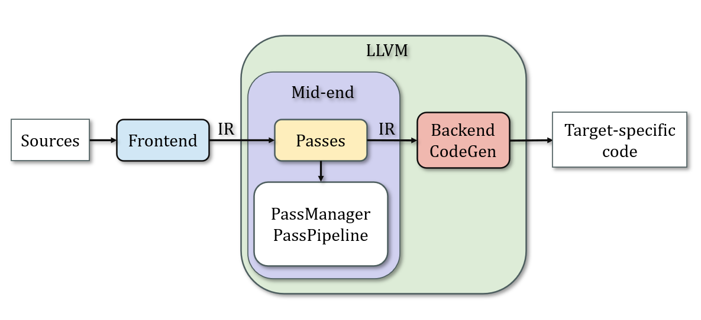
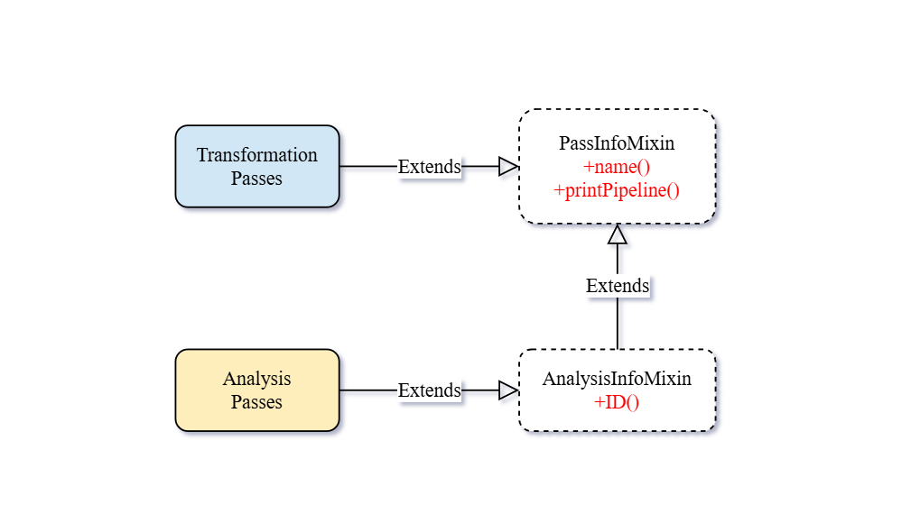
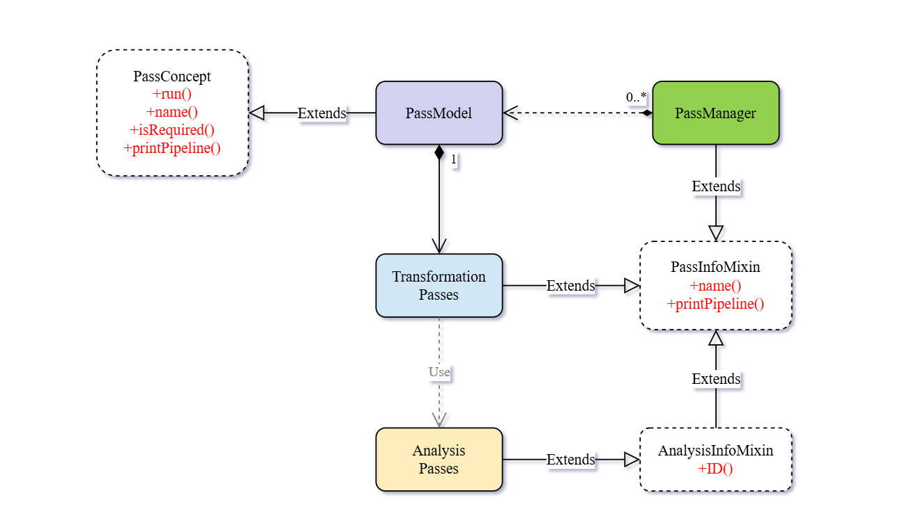
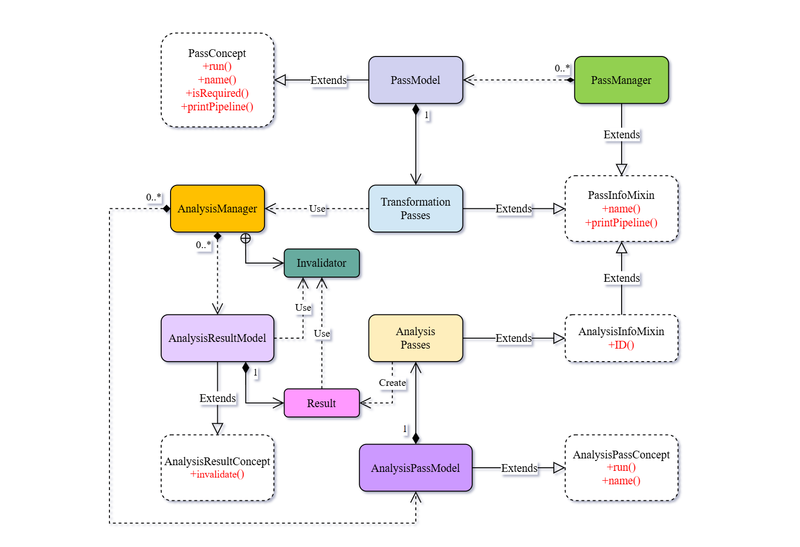
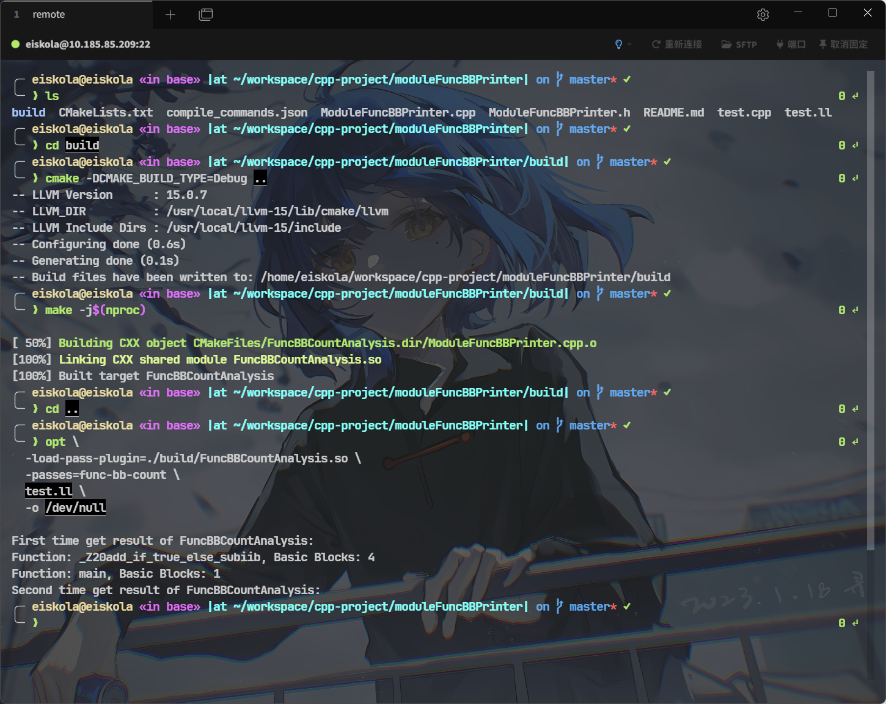

:::caution
&emsp;&emsp;本文内容基于 LLVM 15.0.7 版本，部分内容在其他版本中可能有所不同，请注意差异。
:::

## LLVM 与 Pass
&emsp;&emsp;LLVM 并非一个具体的编译器，而是一套**可复用**、**可组合**的**编译器基础设施**。其设计核心是将编译过程拆解为以**中间表示**（**LLVM IR**）为载体的不同阶段：**前端**负责将不同源码翻译为统一的 IR，**中端**围绕 IR 进行分析与优化，而**后端**则再将优化后的 IR 映射到具体的硬件架构。这里不过多介绍中间表示 IR，而是聚焦于承载实现**分析与优化**目的的LLVM Pass。



&emsp;&emsp;在 LLVM 中，所有对 IR 的 "计算" 都被统一抽象为 Pass（在编译原理里，"Pass" 被称为 "遍" 或者 "趟"，表示对代码做一次扫描）。Pass 是 LLVM 执行分析和优化的基本单位，其运行在某一层级的 IR 上，对程序进行分析或者修改。Pass 分为**分析类 Pass** 和**转换类 Pass**，

$$
\text{Pass} = 
\begin{cases}
    \text{分析类 Pass}: \text{只读取} \\
    \text{转换类 Pass}: \text{可修改}
\end{cases}
$$
前者**只读取** IR 用于构建特定的分析结果，而后者则基于分析结果的基础上**修改** IR，实现各种变换。无论是经典的编译优化，还是用户自定义的程序分析，本质上都是以 Pass 的形式存在。

:::important
&emsp;&emsp;Pass 在 LLVM 中扮演的角色不仅是"实现优化"，更是整个中端架构的核心。
:::

## Pass 分类与类设计
&emsp;&emsp;前面提到，Pass 分为**分析类**（Analysis Pass）和**转换类**（Transformation Pass）两类。实际上，按粒度不同，Pass 还可以进一步划分为**模块级**（ModulePass）、**函数级**（FunctionPass）、**循环级**（LoopPass）等不同层级的 Pass。

&emsp;&emsp;LLVM 15.0.7 基于 **NPM**（New Pass Manager）的全新 Pass 框架，一个核心的修改是通过 [CRTP](https://eiskola.site/posts/pl/c_cpp/templates/crtp/) **静态多态**替换了旧版 Pass Manager 中基于虚函数的动态多态设计。不妨来看一下 NPM 中的 Pass 类设计：

```cpp {4, 12-13}
// $LLVM_HOME/include/llvm/IR/PassManager.h
template <typename DerivedT> struct PassInfoMixin {
  /// Gets the name of the pass we are mixed into.
  static StringRef name() {
    static_assert(std::is_base_of<PassInfoMixin, DerivedT>::value,
                  "Must pass the derived type as the template argument!");
    StringRef Name = getTypeName<DerivedT>();
    Name.consume_front("llvm::");
    return Name;
  }

  void printPipeline(raw_ostream &OS,
                     function_ref<StringRef(StringRef)> MapClassName2PassName) {
    StringRef ClassName = DerivedT::name();
    auto PassName = MapClassName2PassName(ClassName);
    OS << PassName;
  }
};
```
&emsp;&emsp;PassInfoMixin 显然是一个**模板混入类**，通过 [CRTP](https://eiskola.site/posts/pl/c_cpp/templates/crtp/) 方式为派生类**提供了两个通用的方法**（基于 "反射" 实现）：**name()** 用于获取 Pass 的名称，**printPipeline()** 用于打印 Pass 管道信息。PassInfoMixin 是最顶层的 Pass 模板基类，所有具体的 Pass 都会直接或间接地继承自它。

:::tip
&emsp;&emsp;可能你会疑惑，作为 CRTP 模板基类的 PassInfoMixin 并没有直接调用派生类 DerivedT 的任何方法，和 [CRTP](https://eiskola.site/posts/pl/c_cpp/templates/crtp/) 中用法有所差异。实际上，CRTP 的核心思想是通过模板参数将派生类类型传递给基类，让基类知道派生类的类型信息，从而实现静态多态，这里实际上也是如此。
:::

&emsp;&emsp;分析类 Pass 和转换类 Pass 的区别体现在它们各自的模板基类上，分析类 Pass 继承自 AnalysisInfoMixin，而转换类 Pass 则继承自 PassInfoMixin，而 AnalysisInfoMixin 则是继承自 PassInfoMixin：

```cpp {4}
// $LLVM_HOME/include/llvm/IR/PassManager.h
template <typename DerivedT>
struct AnalysisInfoMixin : PassInfoMixin<DerivedT> {
  static AnalysisKey *ID() {
    static_assert(std::is_base_of<AnalysisInfoMixin, DerivedT>::value,
                  "Must pass the derived type as the template argument!");
    return &DerivedT::Key;
  }
};
```

&emsp;&emsp;AnalysisInfoMixin 继承自 PassInfoMixin，同样是一个模板混入类，专用于分析类 Pass。它为分析类 Pass 提供了一个静态方法 **ID()** 用于获取分析类 Pass 的唯一标识符 AnalysisKey（此 Key 的实现也很有意思）。从这里我们也可以看出，继承自 AnalysisInfoMixin 的分析类 Pass 需定义一个**静态成员变量** AnalysisKey 作为其唯一的标识符。



## PassManager 与 AnalysisManager
&emsp;&emsp;到目前为止，我们的 Pass 还只是一个空壳，除了明确分析类 Pass 需提供静态成员变量 AnalysisKey 用于标识外，并没有任何实质性的功能。要让 Pass 真正发挥作用，还需要依赖 PassManager 和 AnalysisManager 来调度和管理 Pass 的执行。

:::tip
&emsp;&emsp;虽然还没有介绍 Pass 的 run 方法，但应该有一个概念：Pass 本身就是一个 "无状态" 的执行单元，既不保存分析结果，也不负责调度，这些职责都交给了 PassManager 和 AnalysisManager。
:::

### PassManager：Pass 的调度与执行
&emsp;&emsp;很容易犯错的一个误区是将 PassManager 理解为转换类 Pass 的管理器，而将 AnalysisManager 理解为分析类 Pass 的管理器，两者负责各自 Pass 的调度执行与管理。实际上，PassManager 才是 Pass 的真正调度者，无论是分析类 Pass 还是转换类 Pass，它们的执行都是由 PassManager 来负责的。

&emsp;&emsp;NPM 中，分析类 Pass 采用所谓的 "**按需计算**" 策略执行，即只有在某个转换类 Pass 需要某个分析类 Pass 的结果时，才会触发该分析类 Pass 的执行。因此，在 $NPM$ 中，对分析类 Pass 的调用，需要通过转换类 Pass 间接触发，于是， PassManager 通过直接调用转换类 Pass 方式间接调用分析类 Pass。

&emsp;&emsp;让我们来看看 PassManager 做了什么：

```cpp
// $LLVM_HOME/include/llvm/IR/PassManager.h
template <typename IRUnitT,
          typename AnalysisManagerT = AnalysisManager<IRUnitT>,
          typename... ExtraArgTs>
class PassManager : public PassInfoMixin<
                        PassManager<IRUnitT, AnalysisManagerT, ExtraArgTs...>> {
public:
  PreservedAnalyses run(IRUnitT &IR, AnalysisManagerT &AM,
                        ExtraArgTs... ExtraArgs) {
    PreservedAnalyses PA = PreservedAnalyses::all();
    PassInstrumentation PI =
        detail::getAnalysisResult<PassInstrumentationAnalysis>(
            AM, IR, std::tuple<ExtraArgTs...>(ExtraArgs...));

    for (unsigned Idx = 0, Size = Passes.size(); Idx != Size; ++Idx) {
      auto *P = Passes[Idx].get();
      if (!PI.runBeforePass<IRUnitT>(*P, IR))
        continue;

      PreservedAnalyses PassPA;
      {
        TimeTraceScope TimeScope(P->name(), IR.getName());
        PassPA = P->run(IR, AM, ExtraArgs...);
      }

      PI.runAfterPass<IRUnitT>(*P, IR, PassPA);
      AM.invalidate(IR, PassPA);
      PA.intersect(std::move(PassPA));
    }

    PA.preserveSet<AllAnalysesOn<IRUnitT>>();

    return PA;
  }

  template <typename PassT>
  LLVM_ATTRIBUTE_MINSIZE
      std::enable_if_t<!std::is_same<PassT, PassManager>::value>
      addPass(PassT &&Pass) {
    using PassModelT =
        detail::PassModel<IRUnitT, PassT, PreservedAnalyses, AnalysisManagerT,
                          ExtraArgTs...>;
    Passes.push_back(std::unique_ptr<PassConceptT>(
        new PassModelT(std::forward<PassT>(Pass))));
  }

  template <typename PassT>
  LLVM_ATTRIBUTE_MINSIZE
      std::enable_if_t<std::is_same<PassT, PassManager>::value>
      addPass(PassT &&Pass) {
    for (auto &P : Pass.Passes)
      Passes.push_back(std::move(P));
  }

  bool isEmpty() const { return Passes.empty(); }
  static bool isRequired() { return true; }

protected:
  using PassConceptT =
      detail::PassConcept<IRUnitT, AnalysisManagerT, ExtraArgTs...>;
  std::vector<std::unique_ptr<PassConceptT>> Passes;
};
```

:::caution
&emsp;&emsp;鉴于篇幅过长，上面的代码片段省略了无需关注的方法和注释。
:::

```cpp "IRUnitT" "AnalysisManagerT" "ExtraArgTs" "ExtraArgTs..."
// $LLVM_HOME/include/llvm/IR/PassManager.h
template <typename IRUnitT,
          typename AnalysisManagerT = AnalysisManager<IRUnitT>,
          typename... ExtraArgTs>
class PassManager : public PassInfoMixin<
                        PassManager<IRUnitT, AnalysisManagerT, ExtraArgTs...>> {
    /* ... */
};
```

&emsp;&emsp;PassManager 同样是一个模板类，继承自 PassInfoMixin 基类且实现了特定的 run() 方法，因此从技术上，PassManager 也是一个合法的 Pass。PassManager 拥有三个模板参数：
- IRUnitT，指定 PassManager 所管理 IR 单位类型，也就是转换类 Pass 的运行粒度（Module、Function、Loop……）；
- AnalysisManagerT，指定了 PassManager 需要用来管理分析结果的 AnalysisManager 类型，默认粒度与 IRUnitT 保持一致，当然也可以传入其他粒度的 AnalysisManager；
- ExtraArgTs，这是一个可变模板参数包，允许传递额外的参数给转换类 Pass，比如需要多个不同粒度的 AnalysisManagerT 时，就可以通过 ExtraArgTs 传递进去。

#### 类型擦除 PassConcept
```cpp "PassConceptT"
// $LLVM_HOME/include/llvm/IR/PassManager.h
template <typename IRUnitT,
          typename AnalysisManagerT = AnalysisManager<IRUnitT>,
          typename... ExtraArgTs>
class PassManager : public PassInfoMixin<
                        PassManager<IRUnitT, AnalysisManagerT, ExtraArgTs...>> {
public:
  /* ... */

protected:
  using PassConceptT =
      detail::PassConcept<IRUnitT, AnalysisManagerT, ExtraArgTs...>;

  std::vector<std::unique_ptr<PassConceptT>> Passes;
};
```

&emsp;&emsp;PassManager 内部通过一个 vector 来保存其所管理的转换类 Pass 列表，但并非直接保存 Pass 对象或其指针，而是保存了 PassConceptT 智能指针。


&emsp;&emsp;此处的 PassConceptT 实际上是一个典型的 "**类型擦除**（Type Erasure）" 实现。需要知道的是，尽管 PassManager 管理的是同一粒度下的转换类 Pass，但这些 Pass 的具体类型不尽相同，毕竟存在可变模板参数 ExtraArgTs，无法通过静态类型来统一表示，也就无法使用 vector 来统一存储。因此，需要一个抽象基类 PassConceptT 来隐藏具体的 Pass 类型，PassManager 便可以用这个接口来统一调用。

&emsp;&emsp;来看看 PassConceptT 的具体实现：

```cpp
// $LLVM_HOME/include/llvm/IR/PassManagerInternal.h
template <typename IRUnitT, typename AnalysisManagerT, typename... ExtraArgTs>
struct PassConcept {
  virtual ~PassConcept() = default;

  virtual PreservedAnalyses run(IRUnitT &IR, AnalysisManagerT &AM,
                                ExtraArgTs... ExtraArgs) = 0;

  virtual void
  printPipeline(raw_ostream &OS,
                function_ref<StringRef(StringRef)> MapClassName2PassName) = 0;

  virtual StringRef name() const = 0;
  virtual bool isRequired() const = 0;
};
```

&emsp;&emsp;PassConcept 是一个**纯虚类**，以**纯虚函数**的方式定义了四个接口，包括 run()、printPipeline()、name() 和 isRequired()，要求其派生类必须实现这些方法。

&emsp;&emsp;其实你也应该发现了，PassConcept 并非转换类 Pass 的抽象基类，因为它并没有继承自 PassInfoMixin，而且也没有必要。因为 PassConcept 只是一个接口类，应该与具体的 Pass 类型解耦。那么，谁来拥有一个具体的转换类 Pass 对象，并实现上面定义的接口？答案是 PassModel：

```cpp {34}
// $LLVM_HOME/include/llvm/IR/PassManagerInternal.h
template <typename IRUnitT, typename PassT, typename PreservedAnalysesT,
          typename AnalysisManagerT, typename... ExtraArgTs>
struct PassModel : PassConcept<IRUnitT, AnalysisManagerT, ExtraArgTs...> {
  PreservedAnalysesT run(IRUnitT &IR, AnalysisManagerT &AM,
                         ExtraArgTs... ExtraArgs) override {
    return Pass.run(IR, AM, ExtraArgs...);
  }

  void printPipeline(
      raw_ostream &OS,
      function_ref<StringRef(StringRef)> MapClassName2PassName) override {
    Pass.printPipeline(OS, MapClassName2PassName);
  }

  StringRef name() const override { return PassT::name(); }

  template <typename T>
  using has_required_t = decltype(std::declval<T &>().isRequired());

  template <typename T>
  static std::enable_if_t<is_detected<has_required_t, T>::value, bool>
  passIsRequiredImpl() {
    return T::isRequired();
  }
  template <typename T>
  static std::enable_if_t<!is_detected<has_required_t, T>::value, bool>
  passIsRequiredImpl() {
    return false;
  }

  bool isRequired() const override { return passIsRequiredImpl<PassT>(); }

  PassT Pass;
};
```
:::caution
&emsp;&emsp;同样这里省略了部分无需关注的方法和注释，后面不再提示。
:::

&emsp;&emsp;PassModel 继承自上面的抽象基类 PassConcept，并实现了其定义的四个接口方法。关注到 PassModel 拥有一个具体的转换类 Pass 对象 PassT Pass，在除 isRequired() 的接口方法实现中，PassModel 都直接调用了该转换类 Pass 的对应方法，从而实现了封装与调用，而对于 isRequired() 方法，则通过检测具体的转换类 Pass 类型是否实现了该方法，来决定是否调用，若没有则直接返回 false。

&emsp;&emsp;转换类 Pass 继承自 PassInfoMixin，基类 PassInfoMixin 提供了 name() 和 printPipeline 的默认实现，因此，对于转换类 Pass 而言，必须实现的只有 run() 方法，这为后续自定义 Pass 提供了指引。

```cpp "PassConceptT"
using PassConceptT =
      detail::PassConcept<IRUnitT, AnalysisManagerT, ExtraArgTs...>;
std::vector<std::unique_ptr<PassConceptT>> Passes;
```

&emsp;&emsp;PassManager 内部通过 PassConceptT 的智能指针来保存其所管理的转换类 Pass 列表，这是一种**动态多态**的实现方式，运行时，基类指针会指向具体的 PassModel 对象，从而实现对不同类型转换类 Pass 的统一管理与调用。




#### run()：真正的调度执行入口
&emsp;&emsp;在介绍 PassManager 的 run() 方法前，有必要先介绍一下 PreservedAnalyses。观察 run() 方法的返回值类型和局部变量类型，可以发现都使用了 PreservedAnalyses 这个类。

&emsp;&emsp;我并不准备在这里对 PreservedAnalyses 进行详细的剖析，而是做一些概念性的引入。PreservedAnalyses 用于表示在某个转换类 Pass 执行后，哪些分析结果仍然有效（这些分析结果是由分析类 Pass 计算得到并缓存的）。因为转换类 Pass 可能会修改 IR，从而导致某些分析结果失效，所以每个转换类 Pass 在执行完毕后，都需要返回一个 PreservedAnalyses 对象，告诉 PassManager **哪些分析结果仍然有效，而哪些需要被废弃**。

&emsp;&emsp;回到 PassManager 的 run() 方法：

```cpp "PreservedAnalyses"
// $LLVM_HOME/include/llvm/IR/PassManager.h
PreservedAnalyses run(IRUnitT &IR, AnalysisManagerT &AM,
                  ExtraArgTs... ExtraArgs) {
  PreservedAnalyses PA = PreservedAnalyses::all();

  PassInstrumentation PI =
      detail::getAnalysisResult<PassInstrumentationAnalysis>(
          AM, IR, std::tuple<ExtraArgTs...>(ExtraArgs...));

  for (unsigned Idx = 0, Size = Passes.size(); Idx != Size; ++Idx) {
    auto *P = Passes[Idx].get();

    if (!PI.runBeforePass<IRUnitT>(*P, IR))
    continue;

    PreservedAnalyses PassPA;
    {
      TimeTraceScope TimeScope(P->name(), IR.getName());
      PassPA = P->run(IR, AM, ExtraArgs...);
    }

    PI.runAfterPass<IRUnitT>(*P, IR, PassPA);
    AM.invalidate(IR, PassPA);
    PA.intersect(std::move(PassPA));
  }

  PA.preserveSet<AllAnalysesOn<IRUnitT>>();

  return PA;
}
```

&emsp;&emsp;你应该注意到了，PassManager 的 run() 方法本身就是一个转换类 Pass 的 run() 实现。这也是为什么前面指明，从技术上来看，PassManager 本身也是一个合法的 Pass 实现。


&emsp;&emsp;考虑 run() 的参数列表，其中 IRUnitT \&IR 是当前 PassManager 所管理的 IR 单位对象的引用，这是一个具体的 IR 实例，比如某个 Module 或者 Function 等，不要理解为 IRUnitT 粒度下的所有单位对象，而是其中具体的一个。传入哪个具体的 IRUnitT 对象不是 PassManager 负责的，而是由上层调用者决定，这点很重要。当然，对其他的 Pass 也是如此。

&emsp;&emsp;关注 run() 方法的实现细节：

```cpp
PreservedAnalyses PA = PreservedAnalyses::all();
```

&emsp;&emsp;这里 PA 是一个通过 PreservedAnalyses::all() 静态方法创建的 PreservedAnalyses 对象，表示**初始状态下，所有分析结果均有效**。这是一个乐观的初始化，后续会根据每个转换类 Pass 的执行逐步收紧。

```cpp "PassInstrumentation" "PassInstrumentationAnalysis"
PassInstrumentation PI =
    detail::getAnalysisResult<PassInstrumentationAnalysis>(
        AM, IR, std::tuple<ExtraArgTs...>(ExtraArgs...));
```
&emsp;&emsp;getAnalysisResult 获取了特定 Pass——PassInstrumentationAnalysis 的一个分析结果对象 PI。PassInstrumentationAnalysis 是一个特殊的分析类 Pass，用于在 Pass 执行前后插入钩子函数，从而实现对 Pass 执行过程的监控和记录，而其返回分析结果——PassInstrumentation 对象中则包含了一系列用于监控和度量的方法的入口。

&emsp;&emsp;我不准备详细介绍 PassInstrumentation 的实现细节，只需要知道其提供了两个方法：runBeforePass 和 runAfterPass，分别在每个转换类 Pass 执行前后被调用，用于插入监控逻辑（比如在执行前判断是否需要跳过该 Pass 的执行等）。

```cpp
for (unsigned Idx = 0, Size = Passes.size(); Idx != Size; ++Idx) {
  auto *P = Passes[Idx].get();

  if (!PI.runBeforePass<IRUnitT>(*P, IR))
  continue;

  PreservedAnalyses PassPA;
  {
    TimeTraceScope TimeScope(P->name(), IR.getName());
    PassPA = P->run(IR, AM, ExtraArgs...);
  }

  PI.runAfterPass<IRUnitT>(*P, IR, PassPA);
  AM.invalidate(IR, PassPA);
  PA.intersect(std::move(PassPA));
}
```

&emsp;&emsp;核心部分的逻辑就比较简单了，遍历 PassManager 内部保存的所有转换类 Pass 列表，依次执行每个 Pass。当然，在 Pass 执行前后调用了 PassInstrumentation 提供的方法进行监控和记录。

&emsp;&emsp;需要关注的是，AnalysisManager（AM）会在每个转换类 Pass 执行结束后，根据该 Pass 返回的 PreservedAnalyses，通过 invalidate() 方法即时废除那些被标记为失效的分析结果缓存。与此同时，PassManager 维护的聚合 PreservedAnalyses（PA）则通过不断调用 intersect() 方法**逐步收紧**，并最终作为该 PassManager 整体的保留分析集合返回给上层调用者。

### AnalysisManager：分析结果的管理与缓存
&emsp;&emsp;AnalysisManager 类模板定义与核心成员如下：

```cpp {26-28}
// $LLVM_HOME/include/llvm/IR/PassManager.h
template <typename IRUnitT, typename... ExtraArgTs>
class AnalysisManager {
public:
  class Invalidator;
private:
  using ResultConceptT =
      detail::AnalysisResultConcept<IRUnitT, PreservedAnalyses, Invalidator>;

  using PassConceptT =
      detail::AnalysisPassConcept<IRUnitT, PreservedAnalyses, Invalidator,
                                  ExtraArgTs...>;

  using AnalysisResultListT =
      std::list<std::pair<AnalysisKey *, std::unique_ptr<ResultConceptT>>>;

  using AnalysisResultListMapT = DenseMap<IRUnitT *, AnalysisResultListT>;

  using AnalysisResultMapT =
      DenseMap<std::pair<AnalysisKey *, IRUnitT *>,
               typename AnalysisResultListT::iterator>;

  using AnalysisPassMapT =
      DenseMap<AnalysisKey *, std::unique_ptr<PassConceptT>>;

  AnalysisPassMapT AnalysisPasses;
  AnalysisResultListMapT AnalysisResultLists;
  AnalysisResultMapT AnalysisResults;
};

```
&emsp;&emsp;同样，我们先关注 AnalysisManager 的模板参数。和 PassManager 一样，IRUnitT 指定了 AnalysisManager 所管理的 IR 单位类型，而 ExtraArgTs 同样是一个可变模板参数包，用于传递额外的参数给分析类 Pass。

#### 类型擦除 AnalysisPassConcept 与 AnalysisResultConcept
&emsp;&emsp;在私有成员中，AnalysisPasses 保存了所有注册的分析类 Pass，其类型为 AnalysisPassMapT，即以 AnalysisKey* 为键，PassConceptT 智能指针为值的 DenseMap。PassConceptT 是 AnalysisPassConcept 的一个类型别名，看到此处，你应该已经猜到了，此处的 PassConceptT 也是一个 "类型擦除" 的实现。

&emsp;&emsp;我们来看看抽象基类 AnalysisPassConcept 的定义：

```cpp
// $LLVM_HOME/include/llvm/IR/PassManagerInternal.h
template <typename IRUnitT, typename PreservedAnalysesT, typename InvalidatorT,
          typename... ExtraArgTs>
struct AnalysisPassConcept {
  virtual ~AnalysisPassConcept() = default;
  virtual std::unique_ptr<
      AnalysisResultConcept<IRUnitT, PreservedAnalysesT, InvalidatorT>>
  run(IRUnitT &IR, AnalysisManager<IRUnitT, ExtraArgTs...> &AM,
      ExtraArgTs... ExtraArgs) = 0;
  virtual StringRef name() const = 0;
};
```

&emsp;&emsp;可以看到，AnalysisPassConcept 定义了两个纯虚函数：run() 和 name() 作为派生类必须实现的接口。于是，我们查看其派生类 AnalysisPassModel 实现：

```cpp {12,18,20} "Pass.run(IR, AM, std::forward<ExtraArgTs>(ExtraArgs)...)"
// $LLVM_HOME/include/llvm/IR/PassManagerInternal.h
template <typename IRUnitT, typename PassT, typename PreservedAnalysesT,
          typename InvalidatorT, typename... ExtraArgTs>
struct AnalysisPassModel : AnalysisPassConcept<IRUnitT, PreservedAnalysesT,
                                               InvalidatorT, ExtraArgTs...> {
  using ResultModelT =
      AnalysisResultModel<IRUnitT, PassT, typename PassT::Result,
                          PreservedAnalysesT, InvalidatorT>;

  std::unique_ptr<
      AnalysisResultConcept<IRUnitT, PreservedAnalysesT, InvalidatorT>>
  run(IRUnitT &IR, AnalysisManager<IRUnitT, ExtraArgTs...> &AM,
      ExtraArgTs... ExtraArgs) override {
    return std::make_unique<ResultModelT>(
        Pass.run(IR, AM, std::forward<ExtraArgTs>(ExtraArgs)...));
  }

  StringRef name() const override { return PassT::name(); }

  PassT Pass;
};
```

&emsp;&emsp;我们只关注 run() 接口实现。AnalysisPassModel 同样拥有一个具体的分析类 Pass，并在 run() 方法中调用了该 Pass 的 run() 方法，获取其分析结果后，封装为 ResultModelT 智能指针并返回。看到这里，我们应该明白，AnalysisPassModel 对分析类 Pass 的实现同样有具体的约束，即必须实现 run() 方法，并返回一个分析结果对象。

&emsp;&emsp;仔细考虑 run() 方法中的这句代码：

```cpp
return std::make_unique<ResultModelT>(
        Pass.run(IR, AM, std::forward<ExtraArgTs>(ExtraArgs)...));
```
&emsp;&emsp;你可能会想，Pass.run() 返回值用于构造 ResultModelT 的智能指针，那 $Pass.run()$ 肯定返回一个 ResultModelT 的对象 。对吗？不对！想要确定分析类 Pass 究竟返回什么类型的分析结果，我们需要剖析另一个 "类型擦除" 的实现—— AnalysisResultConcept。

```cpp "invalidate"
template <typename IRUnitT, typename PreservedAnalysesT, typename InvalidatorT>
struct AnalysisResultConcept {
  virtual ~AnalysisResultConcept() = default;
  virtual bool invalidate(IRUnitT &IR, const PreservedAnalysesT &PA,
                          InvalidatorT &Inv) = 0;
};
```

&emsp;&emsp;和 Pass 一样，分析结果也有不同的静态类型，如何将其统一存储管理，就需要借助 AnalysisResultConcept 实现分析结果的 "类型擦除"。看看其定义的纯虚函数，只有一个 invalidate() 接口，这是用于分析结果失效检查的方法，这部分后面会详细介绍。AnalysisResultModel 继承自此抽象基类：

```cpp {8,13-14,20} "false"
// $LLVM_HOME/include/llvm/IR/PassManagerInternal.h
template <typename IRUnitT, typename PassT, typename ResultT,
          typename PreservedAnalysesT, typename InvalidatorT>
struct AnalysisResultModel<IRUnitT, PassT, ResultT, PreservedAnalysesT,
                           InvalidatorT, false>
    : AnalysisResultConcept<IRUnitT, PreservedAnalysesT, InvalidatorT> {

  explicit AnalysisResultModel(ResultT Result) : Result(std::move(Result)) {}
  AnalysisResultModel(const AnalysisResultModel &Arg) : Result(Arg.Result) {}
  AnalysisResultModel(AnalysisResultModel &&Arg)
      : Result(std::move(Arg.Result)) {}

  bool invalidate(IRUnitT &, const PreservedAnalysesT &PA,
                  InvalidatorT &) override {
    auto PAC = PA.template getChecker<PassT>();
    return !PAC.preserved() &&
           !PAC.template preservedSet<AllAnalysesOn<IRUnitT>>();
  }

  ResultT Result;
};
```
&emsp;&emsp;我们先解决前面的问题：

```cpp
return std::make_unique<ResultModelT>(
        Pass.run(IR, AM, std::forward<ExtraArgTs>(ExtraArgs)...));
```

&emsp;&emsp;Pass.run() 返回了一个分析结果对象 Result 后，实际上调用了 AnalysisResultModel(ResultT Result) 构造函数，构造了一个包含该分析结果的 AnalysisResultModel 对象。

:::important
&emsp;&emsp;现在我们基本上勾勒出了分析类 Pass 的 "形状"。在前面介绍 Pass 分类与类设计时提到，分析类 Pass 都必须定义一个 AnalysisKey 作为其唯一的身份标识，这里我们又要求分析类 Pass 需要实现一个 run() 方法，该方法返回一个分析结果对象。
:::

&emsp;&emsp;实际上这里对分析结果对象并没有过多的约束。你可能注意到，AnalysisResultModel 的 invalidate() 实现并没有调用任何与 Result 相关的方法，这实际上是 LLVM 的一个设计哲学。AnalysisResultModel 被设计为分析结果提供统一接口，当然也包括一套默认的失效检查方法的实现，即 invalidate() 方法。AnalysisManager 通过 AnalysisResultModel 实现对分析结果的统一管理，AM 在检查分析结果是否失效时正是调用了这里的统一接口实现。这当然也降低了自定义 Pass 编写的复杂度。

:::important
&emsp;&emsp;你可能会想，如果我自定义的分析类 Pass 的分析结果对象 Result 需要自定义的失效检查方法呢，又该如何实现？很简单，借助**模板特化**。实际上自定义实现失效检查方法是一个相当普遍的需求，因为当一个分析类 Pass 依赖其他分析结果时，就必须自定义分析结果类的失效检查方法。如何实现 AnalysisResultModel 针对特定实现了自定义 invalidate() 方法的分析结果类的特化呢，需要自己编写吗？答案是不用！

&emsp;&emsp;不知道你是否注意到上面 AnalysisResultModel 模板参数中的 false，其实还存在一个对应的 true 版本的 AnalysisResultModel 实现：

```cpp {9-10} "true" "Result.invalidate"
// $LLVM_HOME/include/llvm/IR/PassManagerInternal.h
template <typename IRUnitT, typename PassT, typename ResultT,
          typename PreservedAnalysesT, typename InvalidatorT>
struct AnalysisResultModel<IRUnitT, PassT, ResultT, PreservedAnalysesT,
                           InvalidatorT, true>
    : AnalysisResultConcept<IRUnitT, PreservedAnalysesT, InvalidatorT> {
  explicit AnalysisResultModel(ResultT Result) : Result(std::move(Result)) {}

  bool invalidate(IRUnitT &IR, const PreservedAnalysesT &PA,
                  InvalidatorT &Inv) override {
    return Result.invalidate(IR, PA, Inv);
  }

  ResultT Result;
};
```
&emsp;&emsp;在这个版本里，invalidate() 调用了分析结果 Result 自定义实现的 invalidate() 方法。


&emsp;&emsp;这里的模板参数 false 和 true 是怎么来的，有何含义？相信你已经猜到了，true 版本对应分析结果类实现了自定义失效检查方法的情况，false 则对应了未实现而使用默认检查逻辑的情况，**这两个都是特化（偏特化）的版本**。我们可以看看主模板声明：

```cpp "HasInvalidateHandler"
template <typename IRUnitT, typename PassT, typename ResultT,
          typename PreservedAnalysesT, typename InvalidatorT,
          bool HasInvalidateHandler =
              ResultHasInvalidateMethod<IRUnitT, ResultT>::Value>
struct AnalysisResultModel;
```

&emsp;&emsp;其中**类型模板参数** HasInvalidateHandler 就是上面两个偏特化版本的来源。这里不深入讨论 LLVM 内部提供的 SFINAE 方法，只需要知道：当 ResultT 实现了自定义 invalidate() 方法时，HasInvalidateHandler 为 true，否则为 false，这些都是在**编译期**可确定的，于是根据这个结果特化出两个偏特化版本。
:::

:::tip
&emsp;&emsp;true 模板参数对应于的偏特化版本正是后面失效检查时依赖传递实现的基础。
:::

&emsp;&emsp;在 AnalysisManager 余下的私有成员中，AnalysisResultLists 保存了具体的 IRUnitT 实例指针到 AnalysisResultListT 的映射，其中 AnalysisResultListT 是一个链表，链上节点存储着分析类 Pass 的唯一标识和其对应的分析结果。而 AnalysisResults 则保存了 <AnalysisKey *, IRUnitT *> 到 AnalysisResultListT::iterator 的映射，即给出了具体分析类 Pass 在具体 IRUnitT 下的分析结果指针（迭代器）。

#### 失效器：Invalidator
&emsp;&emsp;AnalysisManager 实现分析结果的管理和缓存很重要的一个任务就是做好分析结果失效状态的管理和更新。AnalysisManager 类定义了一个嵌套类，用于分析结果的失效检查：

```cpp {5,13,21}  "invalidateImpl"
// $LLVM_HOME/include/llvm/IR/PassManagerInternal.h
class Invalidator {
public:
  template <typename PassT>
  bool invalidate(IRUnitT &IR, const PreservedAnalyses &PA) {
    using ResultModelT =
        detail::AnalysisResultModel<IRUnitT, PassT, typename PassT::Result,
                                    PreservedAnalyses, Invalidator>;

    return invalidateImpl<ResultModelT>(PassT::ID(), IR, PA);
  }

  bool invalidate(AnalysisKey *ID, IRUnitT &IR, const PreservedAnalyses &PA) {
    return invalidateImpl<>(ID, IR, PA);
  }

private:
  friend class AnalysisManager;

  template <typename ResultT = ResultConceptT>
  bool invalidateImpl(AnalysisKey *ID, IRUnitT &IR,
                      const PreservedAnalyses &PA) {
    auto IMapI = IsResultInvalidated.find(ID);
    if (IMapI != IsResultInvalidated.end())
      return IMapI->second;

    auto RI = Results.find({ID, &IR});
    assert(RI != Results.end() &&
            "Trying to invalidate a dependent result that isn't in the "
            "manager's cache is always an error, likely due to a stale result "
            "handle!");

    auto &Result = static_cast<ResultT &>(*RI->second->second);

    bool Inserted;
    std::tie(IMapI, Inserted) =
        IsResultInvalidated.insert({ID, Result.invalidate(IR, PA, *this)});
    (void)Inserted;
    assert(Inserted && "Should not have already inserted this ID, likely "
                        "indicates a dependency cycle!");
    return IMapI->second;
  }

  Invalidator(SmallDenseMap<AnalysisKey *, bool, 8> &IsResultInvalidated,
              const AnalysisResultMapT &Results)
      : IsResultInvalidated(IsResultInvalidated), Results(Results) {}

  SmallDenseMap<AnalysisKey *, bool, 8> &IsResultInvalidated;
  const AnalysisResultMapT &Results;
};
```

&emsp;&emsp;Invaildtor 负责管理和传播分析结果的失效，我们只需要将关注点放在 invalidate() 方法的实现上，Invaildtor 提供了两个 invalidate() 的实现：

```cpp {7,11} "PassT" "ResultModelT"
template <typename PassT>
bool invalidate(IRUnitT &IR, const PreservedAnalyses &PA) {
  using ResultModelT =
      detail::AnalysisResultModel<IRUnitT, PassT, typename PassT::Result,
                                  PreservedAnalyses, Invalidator>;

  return invalidateImpl<ResultModelT>(PassT::ID(), IR, PA);
}

bool invalidate(AnalysisKey *ID, IRUnitT &IR, const PreservedAnalyses &PA) {
  return invalidateImpl<>(ID, IR, PA);
}
```

&emsp;&emsp;这两种实现都使用了同一个核心方法 invalidateImpl()。尽管都是对同一方法的封装，但两者却存在明显的区别，特别是在运行性能上。看看 invalidateImpl() 的具体实现：

```cpp {1} "Result.invalidate(IR, PA, *this)"
template <typename ResultT = ResultConceptT>
bool invalidateImpl(AnalysisKey *ID, IRUnitT &IR,
                    const PreservedAnalyses &PA) {
  auto IMapI = IsResultInvalidated.find(ID);
  if (IMapI != IsResultInvalidated.end())
    return IMapI->second;

  auto RI = Results.find({ID, &IR});
  assert(RI != Results.end() &&
          "Trying to invalidate a dependent result that isn't in the "
          "manager's cache is always an error, likely due to a stale result "
          "handle!");

  auto &Result = static_cast<ResultT &>(*RI->second->second);

  bool Inserted;
  std::tie(IMapI, Inserted) =
      IsResultInvalidated.insert({ID, Result.invalidate(IR, PA, *this)});
  (void)Inserted;
  assert(Inserted && "Should not have already inserted this ID, likely "
                      "indicates a dependency cycle!");
  return IMapI->second;
}
```

&emsp;&emsp;invalidateImpl() 首先检查了当前标识对应的分析类 Pass 是否已经进行过失效检查，若没有则根据标识和具体的 IRUnitT 实例获取指向对应分析结果的迭代器，并通过 static\_cast 获取对应的分析结果 Result，最后通过 Result 调用 invalidate() 执行失效检查逻辑。

&emsp;&emsp;第一种实现将模板参数 ResultModelT 传递给了 invalidateImpl()，使其在编译期便获知分析结果的具体类型，因此后续通过 Result 调用 invalidate() 是通过**静态类型调用**的方式，这一点很重要。而对于 invalidate() 的第二种实现，并没有传递具体的分析结果类型参数 ResultT，因此 invalidateImpl() 使用了默认的类型模板参数，即 ResultT = ResultConcept。也许你仍记得，ResultConcept 是抽象基类，因此在通过 Result 调用 invalidate() 方法时其实是通过**虚函数实现的动态分派**。这就是两者存在的关键区别，也是运行性能差异的关键所在。

:::important
&emsp;&emsp;我们说 Invalidator 支持**依赖传播**的失效检查，其实在分析 AnalysisResultModel 模板特化的时候已经有所体现。当一个分析类 Pass A 依赖其他分析类 Pass B 的分析结果时，为保证 A 的分析结果在 B 失效时也能及时标识失效，LLVM 采用了**依赖者主动检查**，即 Pull 模式。在这种模式下，Pass A 需要在其分析结果类中实现自定义的 invalidate() 方法，并在方法内部主动调用 Invalidator 去检查其所依赖的 Pass B 的分析结果是否失效，从而实现失效信息的传播。
:::

#### AnalysisManager：分析结果的失效管理
&emsp;&emsp;前面我们介绍了 Invalidator 提供的对具体分析结果 Result 执行具有**依赖传播**的失效检查，那么 AnalysisManager 是如何借助 Invalidator 实现其所管理分析类 Pass 分析结果的统一失效检查？

&emsp;&emsp;我们查看 AnalysisManager 中 invalidate() 方法的具体实现：

```cpp {9,37-38} "const PreservedAnalyses &PA" "Result.invalidate(IR, PA, Inv)"
// $LLVM_HOME/include/llvm/IR/PassManagerImpl.h
template <typename IRUnitT, typename... ExtraArgTs>
inline void AnalysisManager<IRUnitT, ExtraArgTs...>::invalidate(
    IRUnitT &IR, const PreservedAnalyses &PA) {
  if (PA.allAnalysesInSetPreserved<AllAnalysesOn<IRUnitT>>())
    return;

  SmallDenseMap<AnalysisKey *, bool, 8> IsResultInvalidated;
  Invalidator Inv(IsResultInvalidated, AnalysisResults);
  AnalysisResultListT &ResultsList = AnalysisResultLists[&IR];
  for (auto &AnalysisResultPair : ResultsList) {
    AnalysisKey *ID = AnalysisResultPair.first;
    auto &Result = *AnalysisResultPair.second;

    auto IMapI = IsResultInvalidated.find(ID);
    if (IMapI != IsResultInvalidated.end())
      continue;

    bool Inserted =
        IsResultInvalidated.insert({ID, Result.invalidate(IR, PA, Inv)}).second;
    (void)Inserted;
    assert(Inserted && "Should never have already inserted this ID, likely "
                      "indicates a cycle!");
  }

  if (!IsResultInvalidated.empty()) {
    for (auto I = ResultsList.begin(), E = ResultsList.end(); I != E;) {
      AnalysisKey *ID = I->first;
      if (!IsResultInvalidated.lookup(ID)) {
        ++I;
        continue;
      }

      if (auto *PI = getCachedResult<PassInstrumentationAnalysis>(IR))
        PI->runAnalysisInvalidated(this->lookUpPass(ID), IR);

      I = ResultsList.erase(I);
      AnalysisResults.erase({ID, &IR});
    }
  }

  if (ResultsList.empty())
    AnalysisResultLists.erase(&IR);
}
```
&emsp;&emsp;AnalysisManager::invalidate() 实现可以分为两个部分。

```cpp "IsResultInvalidated" "Inv"  {2}
SmallDenseMap<AnalysisKey *, bool, 8> IsResultInvalidated;
Invalidator Inv(IsResultInvalidated, AnalysisResults);
AnalysisResultListT &ResultsList = AnalysisResultLists[&IR];
for (auto &AnalysisResultPair : ResultsList) {
  AnalysisKey *ID = AnalysisResultPair.first;
  auto &Result = *AnalysisResultPair.second;

  auto IMapI = IsResultInvalidated.find(ID);
  if (IMapI != IsResultInvalidated.end())
    continue;

  bool Inserted =
      IsResultInvalidated.insert({ID, Result.invalidate(IR, PA, Inv)}).second;
  (void)Inserted;
  assert(Inserted && "Should never have already inserted this ID, likely "
                    "indicates a cycle!");
}
```

&emsp;&emsp;首先遍历具体 IRUnitT 实例对应的分析结果列表，取出每个节点记录的分析类 Pass 的唯一标识和对应分析结果 Result。通过 Result 调用 invalidate() 执行失效检查逻辑（不要忘了，这里的 Result 实际上是 AnalysisResultModel），并将检查结果插入到 IsResultInvalidated 中。

:::important
&emsp;&emsp;IsResultInvalidated 是 AnalysisManager 在一次失效检查过程中维护的判定缓存表，扮演了关键的角色。依赖传播是递归的，而同一个分析结果的失效判定只能做一次，否则重复调用 invalidate() 方法带来的将是指数级的复杂度。

&emsp;&emsp;可以确保的是 LLVM 不存在分析结果的循环依赖，失效检查方法 invalidate() 也就不会存在无穷递归的情况，你可以思考一下为什么（但是 Pass 之间的循环依赖却可能造成 run() 方法的无穷递归调用）。
:::

```cpp {12-13}
if (!IsResultInvalidated.empty()) {
  for (auto I = ResultsList.begin(), E = ResultsList.end(); I != E;) {
    AnalysisKey *ID = I->first;
    if (!IsResultInvalidated.lookup(ID)) {
      ++I;
      continue;
    }

    if (auto *PI = getCachedResult<PassInstrumentationAnalysis>(IR))
      PI->runAnalysisInvalidated(this->lookUpPass(ID), IR);

    I = ResultsList.erase(I);
    AnalysisResults.erase({ID, &IR});
  }
}
```
&emsp;&emsp;当失效检查标记完所有分析结果缓存后才开始执行**真正的**"**失效**"的过程。遍历 IRUnitT 实例对应的分析结果列表，根据失效判定缓存表 IsResultInvalidated 中存储的结果，当标记为 true 是将改分析结果缓存移除（即失效），否则跳过仍保留该分析结果缓存。

&emsp;&emsp;逻辑相对简单，但是我们仍可以有很多思考。在 AnalysisManager 对分析结果缓存执行失效检查过程中，失效器 Inv 的角色是什么？我们回顾 AnalysisResultModel 提供的 invalidate() 接口实现：

```cpp {9-10}
// $LLVM_HOME/include/llvm/IR/PassManagerInternal.h
template <typename IRUnitT, typename PassT, typename ResultT,
          typename PreservedAnalysesT, typename InvalidatorT>
struct AnalysisResultModel<IRUnitT, PassT, ResultT, PreservedAnalysesT,
                           InvalidatorT, true>
    : AnalysisResultConcept<IRUnitT, PreservedAnalysesT, InvalidatorT> {
  explicit AnalysisResultModel(ResultT Result) : Result(std::move(Result)) {}

  bool invalidate(IRUnitT &IR, const PreservedAnalysesT &PA,
                  InvalidatorT &Inv) override {
    return Result.invalidate(IR, PA, Inv);
  }

  ResultT Result;
};
```

&emsp;&emsp;可以看到，其只是简单地将失效器 Inv 传递给了分析结果类自定义实现的失效检查方法 invalidate() 中，为什么呢，你可能会有疑问：难道分析结果类 invalidate() 方法就必须借助失效器 Inv 来执行所依赖分析结果的失效检查逻辑，不能直接调用所依赖分析结果的 invalidate() 方法吗？答案是不能，因为**不借助失效器 Inv 根本拿不到该分析结果**。我们不妨看看分析结果类 invalidate() 的方法签名：

```cpp
bool invalidate(IRUnitT &IR,
                const PreservedAnalyses &PA,
                Invalidator &Inv);
```
&emsp;&emsp;发现根本没有传入任何 AnalysisManager 或 AnalysisResultMap 等可以获取到指定分析结果缓存的参数。而 Invalidator 中恰好保存了 Results：

```cpp "AnalysisResultMapT"
const AnalysisResultMapT &Results
```

&emsp;&emsp;当然这不是唯一的原因，失效器 Inv 的另一个作用是传递失效判定缓存 IsResultInvalidated，其作用这里就不用赘述了吧。

:::tip
&emsp;&emsp;前面我们也提到过，分析类 Pass 采用所谓的 "按需计算" 的策略，只有当某转换类 Pass 依赖其分析结果，且缓存没有命中时才会触发该分析类 Pass 的执行。这里需要注意的是，这部分逻辑并不由转换类 Pass 实现，而是交由 AnalysisManager 负责管理，这也是会在转换类 Pass 的 run() 方法函数签名中看到 AnalysisManager 的原因：

```cpp  "AnalysisManagerT"
PreservedAnalysesT run(IRUnitT &IR, AnalysisManagerT &AM,
                         ExtraArgTs... ExtraArgs)
```
:::



## 动手写一个 Pass
&emsp;&emsp;我们已经学习了编写一个 Pass 需要得一切基础知识，现在让我们动手写一个分析类 Pass 用于打印一个 Module 实例中所有函数名称及其所含基本块数目（跳过函数声明）。

&emsp;&emsp;回顾一下，分析类 Pass 继承自 AnalysisInfoMixin，并且有一个静态成员变量 AnalysisKey Key 作为其唯一得标识。

```cpp
#include "llvm/IR/PassManager.h"

struct FuncBBCountAnalysis: llvm::AnalysisInfoMixin<FuncBBCountAnalysis> {
    // 分析类 Pass ID
    static llvm::AnalysisKey Key;
};
```

&emsp;&emsp;此外，我们需要为其定义 run() 方法，以实现该 Pass 具体逻辑，不过在此之前，需要定义一个**分析结果类**作为 run() 方法返回的分析结果。

```cpp
#include "llvm/IR/PassManager.h"
#include <map>

// 前向声明
struct FuncBBCountAnalysis;

// 分析结果类
struct FuncBBCountResult {
    std::map<std::string, unsigned> FuncBBMap;

    // 失效检查方法，可以省略
    bool invalidate(llvm::Module &M, const llvm::PreservedAnalyses &PA
                , llvm::ModuleAnalysisManager::Invalidator &Inv) {
        auto PAC = PA.getChecker<FuncBBCountAnalysis>();
        if (PAC.preserved() || PAC.preservedSet<llvm::AllAnalysesOn<llvm::Module>>()) {
            return false;
        }
        return true;
    }
};

struct FuncBBCountAnalysis: llvm::AnalysisInfoMixin<FuncBBCountAnalysis> {
    // Pass ID
    static llvm::AnalysisKey Key;
};
```

&emsp;&emsp;你应该发现了，这里定义的分析结果类的 invalidate() 方法与 AnalysisPassModel 提供的默认失效检查逻辑是一致的。我们将要实现的 FuncBBCountAnalysis Pass 并不依赖任何其他分析结果，因此这里可以省略编写 invalidate() 而使用默认实现。

```cpp
#include "llvm/IR/PassManager.h"
#include <map>

// 不再需要
// // 前向声明
// struct FuncBBCountAnalysis;

// 分析结果类
struct FuncBBCountResult {
    std::map<std::string, unsigned> FuncBBMap;

    // 省略
    // // 失效检查方法，可以省略
    // bool invalidate(llvm::Module &M, const llvm::PreservedAnalyses &PA
    //             , llvm::ModuleAnalysisManager::Invalidator &Inv) {
    //     auto PAC = PA.getChecker<FuncBBCountAnalysis>();
    //     if (PAC.preserved() || PAC.preservedSet<llvm::AllAnalysesOn<llvm::Module>>()) {
    //         return false;
    //     }
    //     return true;
    // }
};

struct FuncBBCountAnalysis: llvm::AnalysisInfoMixin<FuncBBCountAnalysis> {
    // Pass ID
    static llvm::AnalysisKey Key;
};
```

&emsp;&emsp;现在有了分析结果类 FuncBBCountResult，那么就可以着手 run() 方法的编写了。逻辑比较简单：遍历 Module 中的所有 Function 并通过相关接口获取信息即可：

```cpp
/// ModuleFuncBBPrinter.h
/// Header file for Module Function Basic Block Printer Pass

#ifndef MODULE_FUNC_BB_PRINTER_H
#define MODULE_FUNC_BB_PRINTER_H

#include "llvm/IR/PassManager.h"
#include "llvm/IR/Module.h"
#include <string>
#include <map>

// 分析结果类：存储[函数名->基本块数目]的映射
struct FuncBBCountResult {
    std::map<std::string, unsigned> FuncBBMap;
};

struct FuncBBCountAnalysis: llvm::AnalysisInfoMixin<FuncBBCountAnalysis> {
    using Result = FuncBBCountResult;

    Result run(llvm::Module &M, llvm::ModuleAnalysisManager &AM) {
        FuncBBCountResult Result;

        // 遍历 Module 中的所有函数
        for (auto &F: M){
            // 跳过声明
            if (F.isDeclaration()) continue;
            std::string FuncName = F.getName().str();
            unsigned BBCount = F.size();
            llvm::errs() << "Function: " << FuncName << ", Basic Blocks: " << BBCount << "\n";

            Result.FuncBBMap[FuncName] = BBCount;
        }

        return Result;
    }

    // Pass ID
    static llvm::AnalysisKey Key;
};
#endif

```

&emsp;&emsp;这个分析类 Pass 我们就编写完成了，前面讲过，分析类 Pass 需要通过转换类 Pass 间接触发运行，因此我们需要为其包装一个转换类 Pass：

```cpp
/// FuncBBCountPrinter.cpp
#include "ModuleFuncBBPrinter.h"
#include "llvm/Passes/PassBuilder.h"
#include "llvm/Passes/PassPlugin.h"
#include "llvm/IR/PassManager.h"

// 初始化分析 ID
llvm::AnalysisKey FuncBBCountAnalysis::Key;

struct FuncBBCountPrinterPass : public llvm::PassInfoMixin<FuncBBCountPrinterPass> {
  llvm::PreservedAnalyses run(llvm::Module &M, llvm::ModuleAnalysisManager &AM) {
    // 获取分析结果，间接触发分析 Pass 的调用
    auto &Result = AM.getResult<FuncBBCountAnalysis>(M);
    return llvm::PreservedAnalyses::all();
  }
};
```

&emsp;&emsp;该转换类 Pass 只是简单地通过 AnalysisManager 获取该自定义分析类 Pass 的分析结果。当缓存不命中时，就会触发 FuncBBCountAnalysis 的执行。其实这里可以验证一下：

```cpp
struct FuncBBCountPrinterPass : public llvm::PassInfoMixin<FuncBBCountPrinterPass> {
  llvm::PreservedAnalyses run(llvm::Module &M, llvm::ModuleAnalysisManager &AM) {
    // 获取分析结果，间接触发分析 Pass 的调用
    llvm::errs() << "First time get result of FuncBBCountAnalysis:\n";
    auto &Result = AM.getResult<FuncBBCountAnalysis>(M);
    // 再次获取，期望命中缓存，无打印信息输出
    llvm::errs() << "Second time get result of FuncBBCountAnalysis:\n";
    auto &CachedResult = AM.getResult<FuncBBCountAnalysis>(M);
    // 保留所有分析缓存
    return llvm::PreservedAnalyses::all();
  }
};
```

&emsp;&emsp;下面就是 Pass 的注册逻辑了，鉴于篇幅原因便不在此深入。下面给出完整代码：

```cpp
/// FuncBBCountPrinter.cpp
#include "ModuleFuncBBPrinter.h"
#include "llvm/Passes/PassBuilder.h"
#include "llvm/Passes/PassPlugin.h"
#include "llvm/IR/PassManager.h"

// 初始化分析 ID
llvm::AnalysisKey FuncBBCountAnalysis::Key;

struct FuncBBCountPrinterPass : public llvm::PassInfoMixin<FuncBBCountPrinterPass> {
  llvm::PreservedAnalyses run(llvm::Module &M, llvm::ModuleAnalysisManager &AM) {
    llvm::errs() << "First time get result of FuncBBCountAnalysis:\n";
    auto &Result = AM.getResult<FuncBBCountAnalysis>(M);
    // 再次获取，期望命中缓存，无打印信息输出
    llvm::errs() << "Second time get result of FuncBBCountAnalysis:\n";
    auto &CachedResult = AM.getResult<FuncBBCountAnalysis>(M);
    // 保留所有分析缓存
    return llvm::PreservedAnalyses::all();
  }
};

// 注册分析 Pass 与 转换 Pass
llvm::PassPluginLibraryInfo getFuncBBCountPluginInfo() {
  return {
    LLVM_PLUGIN_API_VERSION,
    "FuncBBCountAnalysis",
    LLVM_VERSION_STRING,
    [](llvm::PassBuilder &PB) {
      // 注册分析 Pass 到 ModuleAnalysisManager
      PB.registerAnalysisRegistrationCallback(
        [](llvm::ModuleAnalysisManager &MAM) {
          MAM.registerPass([] { return FuncBBCountAnalysis(); });
        }
      );

      // 注册可直接调用的转换 Pass 到 ModulePassManager
      PB.registerPipelineParsingCallback(
        [](llvm::StringRef Name, llvm::ModulePassManager &MPM,
           llvm::ArrayRef<llvm::PassBuilder::PipelineElement>) {
          // Pass 名称：func-bb-count，命令行调用此名称
          if (Name == "func-bb-count") {
            MPM.addPass(FuncBBCountPrinterPass());
            return true;
          }
          return false;
        }
      );
    }
  };
}

// 插件入口
extern "C" LLVM_ATTRIBUTE_WEAK ::llvm::PassPluginLibraryInfo
llvmGetPassPluginInfo() {
  return getFuncBBCountPluginInfo();
}
```
&emsp;&emsp;CMakeLists.txt 作参考：

```cmake
cmake_minimum_required(VERSION 3.18)
project(FuncBBCountAnalysis LANGUAGES C CXX)

set(CMAKE_EXPORT_COMPILE_COMMANDS ON)

find_package(LLVM REQUIRED CONFIG)

message(STATUS "LLVM Version      : ${LLVM_PACKAGE_VERSION}")
message(STATUS "LLVM_DIR          : ${LLVM_DIR}")
message(STATUS "LLVM Include Dirs : ${LLVM_INCLUDE_DIRS}")

set(CMAKE_CXX_STANDARD 17)
set(CMAKE_CXX_STANDARD_REQUIRED ON)

include_directories(${LLVM_INCLUDE_DIRS})
add_definitions(${LLVM_DEFINITIONS})

add_library(FuncBBCountAnalysis MODULE
  ModuleFuncBBPrinter.cpp
)

set_target_properties(FuncBBCountAnalysis PROPERTIES
  PREFIX ""
  SUFFIX ".so"
  COMPILE_FLAGS "-fno-rtti -fPIC"
)

if (EXISTS "${CMAKE_BINARY_DIR}/compile_commands.json")
  execute_process(
    COMMAND ${CMAKE_COMMAND} -E copy_if_different
            ${CMAKE_BINARY_DIR}/compile_commands.json
            ${CMAKE_SOURCE_DIR}/compile_commands.json
  )
endif()
```

&emsp;&emsp;构建、运行参考下面命令：

```sh
mkdir build && cd build
cmake -DCMAKE_BUILD_TYPE=[Debug|Release] ..
make -j$(nproc)

cd ..

opt \
  -load-pass-plugin=./build/FuncBBCountAnalysis.so \
  -passes=func-bb-count \
  test.ll \
  -o /dev/null
```

&emsp;&emsp;运行结果：
