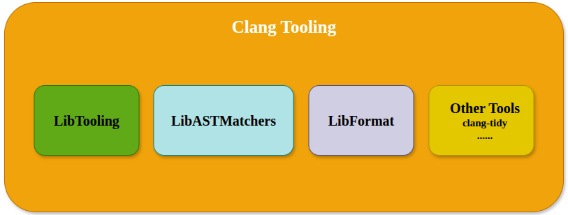
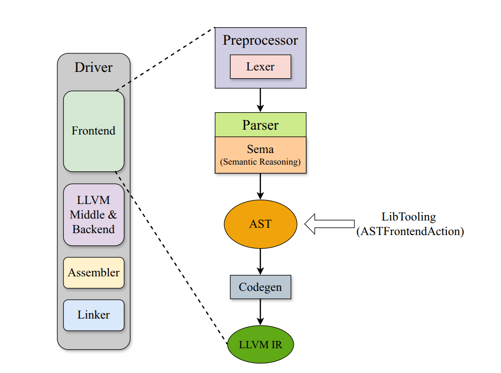
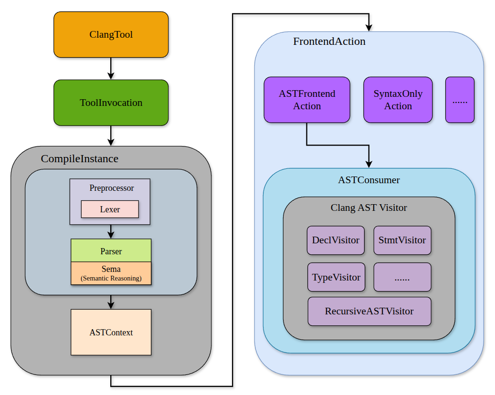
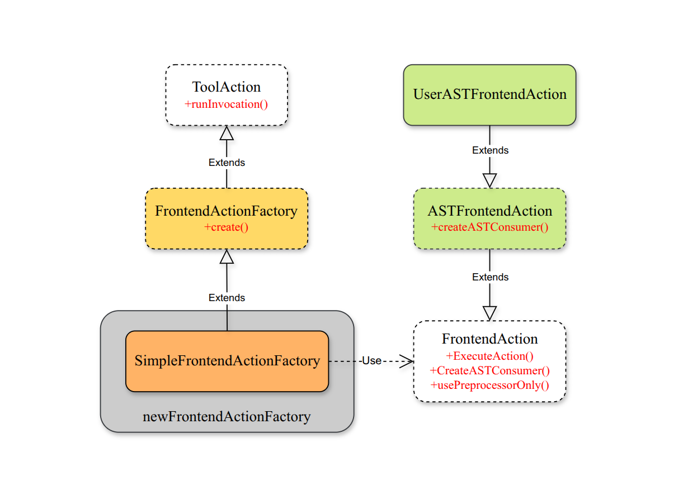
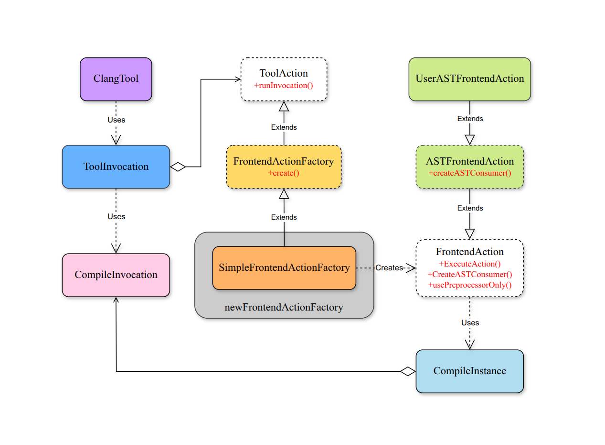

:::caution
&emsp;&emsp;本文内容基于 LLVM 15.0.7 版本，部分内容在其他版本中可能有所不同，请注意差异。
:::

# Clang Tooling 与 LibTooling
&emsp;&emsp;Clang 作为 LLVM 默认前端，提供了强大的编译器基础设施和丰富的 API，使得开发者能够构建各种基于 Clang 的工具。Clang Tooling 是一个概念范畴，泛指基于 Clang 构建工具的整个体系，如下图。



&emsp;&emsp;LibTooling 是 Clang Tooling 中的一个核心库，提供复用 Clang 前端模块的能力，使得开发者能够专注于工具的业务逻辑，而无需关心底层的编译器实现细节。我们知道，Clang 前端本身包含完整的词法分析、语法分析、语义分析和类型系统等模块，LibTooling 做的事情是**把这些原本只服务于编译流程的模块暴露出来，让外部工具可以直接复用**，而不需要自己重新实现一遍 C++ 的解析逻辑。

&emsp;&emsp;以 AST 相关的 FrontendAction 为例，下图展示了 Clang 前端架构，以及 LibTooling 实际的介入点。这里的 "介入点" 并非 LibTooling 跳过了前面的阶段，而是指 LibTooling 复用了编译器前端的全部流程，在 AST 完成后拿到控制权，在 CodeGen 之前退出。



# LibTooling 核心架构
&emsp;&emsp;一个外部工具想要复用 Clang 前端，有几方面的问题。一是谁来驱动多文件的编译？基于 Clang 的工具通常需要处理多个源文件，由谁来负责驱动这些源文件的编译流程；二是单次编译如何组装与启动？Clang 的编译流程是以单个源文件为单位的，工具如何组装 Clang 的编译流程；三是控制权如何交接？前端完成编译流程后，工具何时以及如何接管控制权来完成分析或变换的逻辑；四是如何支持工具的业务逻辑？LibTooling 需要提供什么样的接口来支持工具实现自己的业务逻辑。

&emsp;&emsp;LibTooling 的核心架构设计正是围绕这些问题来组织的，如下图所示。下面我们将逐一分析 LibTooling 的核心组件以及它们之间的协作机制。



## ClangTool：工具驱动器
&emsp;&emsp;在 LibTooling 中，ClangTool 可以看作是一个工具运行时的调度器。它的职责类似于在 Clang 编译流程中的 clang driver：负责读取编译数据库，构造编译参数，并驱动 FrontendAction 在一组源文件上执行。

&emsp;&emsp;不同的是，clang driver 驱动的是完整的编译流程，而 ClangTool 只负责驱动 Clang 前端。下面是 ClangTool 的核心定义：

```cpp "ClangTool" "run"
// clang/include/clang/Tooling/Tooling.h
class ClangTool {
public:
  ClangTool(const CompilationDatabase &Compilations,
            ArrayRef<std::string> SourcePaths,
            std::shared_ptr<PCHContainerOperations> PCHContainerOps =
                std::make_shared<PCHContainerOperations>(),
            IntrusiveRefCntPtr<llvm::vfs::FileSystem> BaseFS =
                llvm::vfs::getRealFileSystem(),
            IntrusiveRefCntPtr<FileManager> Files = nullptr);

  ~ClangTool();

  void mapVirtualFile(StringRef FilePath, StringRef Content);

  void appendArgumentsAdjuster(ArgumentsAdjuster Adjuster);

  int run(ToolAction *Action);

  int buildASTs(std::vector<std::unique_ptr<ASTUnit>> &ASTs);
};
```
### ClangTool() 构造函数
&emsp;&emsp;我们把目光放在构造函数函数签名上：

```cpp "Compilations" "SourcePaths"
ClangTool(const CompilationDatabase &Compilations,
        ArrayRef<std::string> SourcePaths,
        std::shared_ptr<PCHContainerOperations> PCHContainerOps =
            std::make_shared<PCHContainerOperations>(),
        IntrusiveRefCntPtr<llvm::vfs::FileSystem> BaseFS =
            llvm::vfs::getRealFileSystem(),
        IntrusiveRefCntPtr<FileManager> Files = nullptr);
```

&emsp;&emsp;作为 LibTooling 的核心调度器，ClangTool 构造函数接受多个参数，最重要的两个参数即：Compilations 和 SourcePaths。

&emsp;&emsp;Compilations 是一个 CompilationDatabase 对象的引用，CompilationDatabase 是 Clang 编译数据库的抽象表示，封装了编译命令、编译选项和编译环境等信息。对于**编译数据库**我想你并不陌生，在 [clangd 介绍](https://eiskola.github.io/posts/llvm/tools/vscodeclangd/) 中我们已经了解过了。而对于 SourcePaths，顾名思义，其中包含了需要处理的源文件路径列表。ClangTool 会根据 SourcePaths 中的每个源文件，在 Compilations 中查找对应的编译命令和选项，然后驱动 Clang 前端来处理。

### ClangTool::run() 方法
&emsp;&emsp;ClangTool 的核心逻辑由方法 run() 实现：

```cpp
int ClangTool::run(ToolAction *Action) {
  static int StaticSymbol;
  if (SeenWorkingDirectories.insert("/").second)
    for (const auto &MappedFile : MappedFileContents)
      if (llvm::sys::path::is_absolute(MappedFile.first))
        InMemoryFileSystem->addFile(
            MappedFile.first, 0,
            llvm::MemoryBuffer::getMemBuffer(MappedFile.second));

  bool ProcessingFailed = f alse;
  bool FileSkipped = false;
  std::vector<std::string> AbsolutePaths;
  AbsolutePaths.reserve(SourcePaths.size());
  for (const auto &SourcePath : SourcePaths) {
    auto AbsPath = getAbsolutePath(*OverlayFileSystem, SourcePath);
    if (!AbsPath) {
      llvm::errs() << "Skipping " << SourcePath
                   << ". Error while getting an absolute path: "
                   << llvm::toString(AbsPath.takeError()) << "\n";
      continue;
    }
    AbsolutePaths.push_back(std::move(*AbsPath));
  }
  std::string InitialWorkingDir;
  if (RestoreCWD) {
    if (auto CWD = OverlayFileSystem->getCurrentWorkingDirectory()) {
      InitialWorkingDir = std::move(*CWD);
    } else {
      llvm::errs() << "Could not get working directory: "
                   << CWD.getError().message() << "\n";
    }
  }

  for (llvm::StringRef File : AbsolutePaths) {
    std::vector<CompileCommand> CompileCommandsForFile =
        Compilations.getCompileCommands(File);
    if (CompileCommandsForFile.empty()) {
      llvm::errs() << "Skipping " << File << ". Compile command not found.\n";
      FileSkipped = true;
      continue;
    }
    for (CompileCommand &CompileCommand : CompileCommandsForFile) {
      if (OverlayFileSystem->setCurrentWorkingDirectory(
              CompileCommand.Directory))
        llvm::report_fatal_error("Cannot chdir into \"" +
                                 Twine(CompileCommand.Directory) + "\"!");

      if (SeenWorkingDirectories.insert(CompileCommand.Directory).second)
        for (const auto &MappedFile : MappedFileContents)
          if (!llvm::sys::path::is_absolute(MappedFile.first))
            InMemoryFileSystem->addFile(
                MappedFile.first, 0,
                llvm::MemoryBuffer::getMemBuffer(MappedFile.second));

      std::vector<std::string> CommandLine = CompileCommand.CommandLine;
      if (ArgsAdjuster)
        CommandLine = ArgsAdjuster(CommandLine, CompileCommand.Filename);
      assert(!CommandLine.empty());
      injectResourceDir(CommandLine, "clang_tool", &StaticSymbol);
      LLVM_DEBUG({ llvm::dbgs() << "Processing: " << File << ".\n"; });
      ToolInvocation Invocation(std::move(CommandLine), Action, Files.get(),
                                PCHContainerOps);
      Invocation.setDiagnosticConsumer(DiagConsumer);

      if (!Invocation.run()) {
        // FIXME: Diagnostics should be used instead.
        if (PrintErrorMessage)
          llvm::errs() << "Error while processing " << File << ".\n";
        ProcessingFailed = true;
      }
    }
  }

  if (!InitialWorkingDir.empty()) {
    if (auto EC =
            OverlayFileSystem->setCurrentWorkingDirectory(InitialWorkingDir))
      llvm::errs() << "Error when trying to restore working dir: "
                   << EC.message() << "\n";
  }
  return ProcessingFailed ? 1 : (FileSkipped ? 2 : 0);
}
```
&emsp;&emsp;整体上看，作为 ClangTool 乃至 LibTooliong 的核心逻辑实现，run() 方法负责从 Compilations 获取每个源文件的编译命令，然后为编译命令构造 ToolInvocation，最终通过 ToolInvocation 驱动 FrontendAction 的执行。我们根据源码逐步分析实现细节。

```cpp
if (SeenWorkingDirectories.insert("/").second)
    for (const auto &MappedFile : MappedFileContents)
      if (llvm::sys::path::is_absolute(MappedFile.first))
        InMemoryFileSystem->addFile(
            MappedFile.first, 0,
            llvm::MemoryBuffer::getMemBuffer(MappedFile.second));
```

&emsp;&emsp;首先，SeenWorkingDirectories 记录了已经访问过的工作目录，类型为 llvm::StringSet<>，底层实现是一个基于 map 的字符串集合，其 second 字段表示插入是否成功，插入成功即表明之前没有访问过这个目录。

&emsp;&emsp;ClangTool 支持虚拟文件系统（VFS），允许工具在内存中创建虚拟文件，并将其映射到 Clang 的文件系统中。这里的逻辑是，如果 MappedFileContents 中存在绝对路径（与当前工作路径无关，可以直接添加）的虚拟文件，那么将这些文件添加到 InMemoryFileSystem 中。

:::important
&emsp;&emsp;实际上，ClangTool 在执行时会构建一个 OverlayFileSystem（叠加文件系统），这部分体现在 ClangTool 构造函数中：

```cpp {8-9} {12}
ClangTool::ClangTool(const CompilationDatabase &Compilations,
                     ArrayRef<std::string> SourcePaths,
                     std::shared_ptr<PCHContainerOperations> PCHContainerOps,
                     IntrusiveRefCntPtr<llvm::vfs::FileSystem> BaseFS,
                     IntrusiveRefCntPtr<FileManager> Files)
    : Compilations(Compilations), SourcePaths(SourcePaths),
      PCHContainerOps(std::move(PCHContainerOps)),
      OverlayFileSystem(new llvm::vfs::OverlayFileSystem(std::move(BaseFS))),
      InMemoryFileSystem(new llvm::vfs::InMemoryFileSystem),
      Files(Files ? Files
                  : new FileManager(FileSystemOptions(), OverlayFileSystem)) {
  OverlayFileSystem->pushOverlay(InMemoryFileSystem);
  appendArgumentsAdjuster(getClangStripOutputAdjuster());
  appendArgumentsAdjuster(getClangSyntaxOnlyAdjuster());
  appendArgumentsAdjuster(getClangStripDependencyFileAdjuster());
  if (Files)
    Files->setVirtualFileSystem(OverlayFileSystem);
}
```

&emsp;&emsp;OverlayFileSystem 实际上是一个文件系统栈，这里 BaseFS ，即真实文件系统首先被添加到栈底，然后再压入 InMemoryFileSystem 虚拟文件系统，如下所示：

```text
OverlayFileSystem
 ├── InMemoryFileSystem
 └── RealFileSystem
```

&emsp;&emsp;因此，在 run() 方法中，ClangTool 会首先检查虚拟文件系统 InMemoryFileSystem 以处理存在的虚拟文件，而如果普通工具不使用虚拟文件，则最终会回退到真实文件系统，处理磁盘上的源文件。
:::

&emsp;&emsp;下面我们聚焦 run() 方法的核心逻辑。

```cpp {1} {9}
for (llvm::StringRef File : AbsolutePaths) {
  std::vector<CompileCommand> CompileCommandsForFile =
      Compilations.getCompileCommands(File);
  if (CompileCommandsForFile.empty()) {
    llvm::errs() << "Skipping " << File << ". Compile command not found.\n";
    FileSkipped = true;
    continue;
  }
  for (CompileCommand &CompileCommand : CompileCommandsForFile) {
    if (OverlayFileSystem->setCurrentWorkingDirectory(
            CompileCommand.Directory))
      llvm::report_fatal_error("Cannot chdir into \"" +
                                Twine(CompileCommand.Directory) + "\"!");

    if (SeenWorkingDirectories.insert(CompileCommand.Directory).second)
      for (const auto &MappedFile : MappedFileContents)
        if (!llvm::sys::path::is_absolute(MappedFile.first))
          InMemoryFileSystem->addFile(
              MappedFile.first, 0,
              llvm::MemoryBuffer::getMemBuffer(MappedFile.second));

    std::vector<std::string> CommandLine = CompileCommand.CommandLine;
    if (ArgsAdjuster)
      CommandLine = ArgsAdjuster(CommandLine, CompileCommand.Filename);
    assert(!CommandLine.empty());
    injectResourceDir(CommandLine, "clang_tool", &StaticSymbol);
    LLVM_DEBUG({ llvm::dbgs() << "Processing: " << File << ".\n"; });
    ToolInvocation Invocation(std::move(CommandLine), Action, Files.get(),
                              PCHContainerOps);
    Invocation.setDiagnosticConsumer(DiagConsumer);

    if (!Invocation.run()) {
      if (PrintErrorMessage)
        llvm::errs() << "Error while processing " << File << ".\n";
      ProcessingFailed = true;
    }
  }
}
```

&emsp;&emsp;ClangTool 会遍历 SourcePaths 中的每个源文件，首先通过 getCompileCommands() 获取该源文件对应的编译命令列表。CompilationDatabase 可能会返回多个编译命令，因为同一个源文件可能在不同的编译环境下被编译（例如不同的编译选项）。如果没有找到编译命令，则跳过该文件。

```cpp "!llvm::sys::path::is_absolute(MappedFile.first)"
if (OverlayFileSystem->setCurrentWorkingDirectory(
            CompileCommand.Directory))
  llvm::report_fatal_error("Cannot chdir into \"" +
                            Twine(CompileCommand.Directory) + "\"!");

if (SeenWorkingDirectories.insert(CompileCommand.Directory).second)
  for (const auto &MappedFile : MappedFileContents)
    if (!llvm::sys::path::is_absolute(MappedFile.first))
      InMemoryFileSystem->addFile(
          MappedFile.first, 0,
          llvm::MemoryBuffer::getMemBuffer(MappedFile.second));
```

&emsp;&emsp;对于每个编译命令，ClangTool 首先切换当前工作目录到编译命令指定的目录，这样可以确保后续的文件访问和编译环境一致。然后，如果这是第一次访问这个工作目录，还会将**相对路径**的虚拟文件添加到 InMemoryFileSystem 中（之前已经处理过绝对路径的虚拟文件）。

&emsp;&emsp;接下来，ClangTool 从编译命令中提取出编译参数列表，并通过 ArgsAdjuster 进行调整（如果有的话）。ArgsAdjuster 是一个函数对象，可以用来修改编译参数，例如添加或删除某些选项。ClangTool 内置了一些常用的 ArgsAdjuster，例如 getClangStripOutputAdjuster() 用于去除输出相关的参数，getClangSyntaxOnlyAdjuster() 用于添加 -fsyntax-only 参数以仅进行语法检查。

```cpp {1} "Invocation.run()"
ToolInvocation Invocation(std::move(CommandLine), Action, Files.get(),
                              PCHContainerOps);
Invocation.setDiagnosticConsumer(DiagConsumer);

if (!Invocation.run()) {
  if (PrintErrorMessage)
    llvm::errs() << "Error while processing " << File << ".\n";
  ProcessingFailed = true;
}
```
&emsp;&emsp;ClangTool 通过 ToolInvocation 来驱动 FrontendAction 的执行。ToolInvocation 是 LibTooling 中一个重要的类，封装了编译命令、前端动作和相关的环境信息。调用 Invocation.run() 会启动 Clang 前端的编译流程，并在完成后将控制权交给 FrontendAction 来执行工具的业务逻辑。

## ToolInvocation：编译命令到前端动作执行的桥梁
&emsp;&emsp;ToolInvocation 是 LibTooling 中负责从编译命令到前端动作执行的桥梁组件。在真正执行前端动作之前，ToolInvocation 需要完成一些准备工作。其中，最重要的是根据编译命令构造 CompileInvocation——一个包含了编译参数、文件系统和诊断信息等执行环境信息的对象，包含了前端编译流程所需的全部信息。

&emsp;&emsp;ToolInvocation 核心定义如下：

```cpp {15} {18-21} {24} "ToolInvocation"
// clang/include/clang/Tooling/Tooling.h
class ToolInvocation {
public:
  ToolInvocation(std::vector<std::string> CommandLine,
                 std::unique_ptr<FrontendAction> FAction, FileManager *Files,
                 std::shared_ptr<PCHContainerOperations> PCHContainerOps =
                     std::make_shared<PCHContainerOperations>());

  ToolInvocation(std::vector<std::string> CommandLine, ToolAction *Action,
                 FileManager *Files,
                 std::shared_ptr<PCHContainerOperations> PCHContainerOps);

  ~ToolInvocation();

  bool run();

 private:
  bool runInvocation(const char *BinaryName,
                     driver::Compilation *Compilation,
                     std::shared_ptr<CompilerInvocation> Invocation,
                     std::shared_ptr<PCHContainerOperations> PCHContainerOps);

  std::vector<std::string> CommandLine;
  ToolAction *Action;
  bool OwnsAction;
  FileManager *Files;
  std::shared_ptr<PCHContainerOperations> PCHContainerOps;
  DiagnosticConsumer *DiagConsumer = nullptr;
  DiagnosticOptions *DiagOpts = nullptr;
};
```
### ToolInvocation 构造函数
&emsp;&emsp;我们观察 ToolInvocation 的两个构造函数，对，是两个。

```cpp "FrontendAction" "FAction" "ToolAction" "Action"
ToolInvocation(std::vector<std::string> CommandLine,
                std::unique_ptr<FrontendAction> FAction, FileManager *Files,
                std::shared_ptr<PCHContainerOperations> PCHContainerOps =
                    std::make_shared<PCHContainerOperations>());

ToolInvocation(std::vector<std::string> CommandLine, ToolAction *Action,
                FileManager *Files,
                std::shared_ptr<PCHContainerOperations> PCHContainerOps);
```

&emsp;&emsp;两者最大的区别就在于，前者直接接受一个 FrontendAction 的智能指针，而后者则接受 ToolAction 指针。我想是时候介绍一下 ToolAction 了，如果你对 ClangTool::run() 方法还有印象的话，你就会发现 ClangTool::run() 方法正是接受一个 ToolAction 指针作为参数。

#### 工厂方法模式：FrontendActionFactory 与 FrontendAction
&emsp;&emsp;ToolAction 定义如下：

```cpp {7-11}
// clang/include/clang/Tooling/Tooling.h
class ToolAction {
public:
  virtual ~ToolAction();

  /// Perform an action for an invocation.
  virtual bool
  runInvocation(std::shared_ptr<CompilerInvocation> Invocation,
                FileManager *Files,
                std::shared_ptr<PCHContainerOperations> PCHContainerOps,
                DiagnosticConsumer *DiagConsumer) = 0;
};
```
&emsp;&emsp;可以看到，ToolAction 是一个抽象基类，实际上作为一个工厂接口基类，定义了一个纯虚函数 runInvocation() 作为接口。而抽象工厂 FrontendActionFactory 继承自 ToolAction，并实现了 runInvocation() 来创建和执行 FrontendAction，如下所示：

```cpp {7-10} {13}
// clang/include/clang/Tooling/Tooling.h
class FrontendActionFactory : public ToolAction {
public:
  ~FrontendActionFactory() override;

  /// Invokes the compiler with a FrontendAction created by create().
  bool runInvocation(std::shared_ptr<CompilerInvocation> Invocation,
                     FileManager *Files,
                     std::shared_ptr<PCHContainerOperations> PCHContainerOps,
                     DiagnosticConsumer *DiagConsumer) override;

  /// Returns a new clang::FrontendAction.
  virtual std::unique_ptr<FrontendAction> create() = 0;
};
```

&emsp;&emsp;正如你所见，FrontendActionFactory 实际上也是一个抽象基类，定义了一个纯虚函数 create()，用于创建具体 FrontendAction 的实例。FrontendActionFactory 的设计是经典的工厂方法模式，派生类继承自 FrontendActionFactory，并实现工厂方法 create() 来创建具体的FrontendAction 实例。

&emsp;&emsp;当然，create() 方法返回指向 FrontendAction 的智能指针，我认为你应该敏锐的想到，FrontendAction 也是一个抽象基类，不同的前端动作，如 ASTFrontendAction、SyntaxOnlyAction 等都继承自它：

```cpp "public FrontendAction"
// clang/include/clang/Frontend/FrontendAction.h
class ASTFrontendAction : public FrontendAction {
protected:
  void ExecuteAction() override;

public:
  ASTFrontendAction() {}
  bool usesPreprocessorOnly() const override { return false; }
};
```
&emsp;&emsp;ClangTool 提供了用于创建具体的 FrontendActionFactory 实例的方法：

```cpp {2-3}
// clang/include/clang/Tooling/Tooling.h
template <typename T>
std::unique_ptr<FrontendActionFactory> newFrontendActionFactory() {
  class SimpleFrontendActionFactory : public FrontendActionFactory {
  public:
    std::unique_ptr<FrontendAction> create() override {
      return std::make_unique<T>();
    }
  };

  return std::unique_ptr<FrontendActionFactory>(
      new SimpleFrontendActionFactory);
}
```
&emsp;&emsp;这是简单的模板函数实现，接受一个 FrontendAction 派生类类型 T 作为模板参数，内部定义的简单前端动作工厂类 SimpleFrontendActionFactory 继承自 FrontendActionFactory，并实现 create() 方法来创建 T 类型的 FrontendAction 实例。这样，用户只需要调用 newFrontendActionFactory\<T\>().create() 就可以得到一个 T 类型的 FrontendAction 实例了。

:::note
&emsp;&emsp;实际上还存在另一个 newFrontendActionFactory() 实现：

```cpp {5} {17}
// clang/include/clang/Tooling/Tooling.h
template <typename FactoryT>
inline std::unique_ptr<FrontendActionFactory> newFrontendActionFactory(
    FactoryT *ConsumerFactory, SourceFileCallbacks *Callbacks) {
  class FrontendActionFactoryAdapter : public FrontendActionFactory {
  public:
    explicit FrontendActionFactoryAdapter(FactoryT *ConsumerFactory,
                                          SourceFileCallbacks *Callbacks)
        : ConsumerFactory(ConsumerFactory), Callbacks(Callbacks) {}

    std::unique_ptr<FrontendAction> create() override {
      return std::make_unique<ConsumerFactoryAdaptor>(ConsumerFactory,
                                                      Callbacks);
    }

  private:
    class ConsumerFactoryAdaptor : public ASTFrontendAction {
    public:
      ConsumerFactoryAdaptor(FactoryT *ConsumerFactory,
                             SourceFileCallbacks *Callbacks)
          : ConsumerFactory(ConsumerFactory), Callbacks(Callbacks) {}

      std::unique_ptr<ASTConsumer>
      CreateASTConsumer(CompilerInstance &, StringRef) override {
        return ConsumerFactory->newASTConsumer();
      }

    protected:
      bool BeginSourceFileAction(CompilerInstance &CI) override {
        if (!ASTFrontendAction::BeginSourceFileAction(CI))
          return false;
        if (Callbacks)
          return Callbacks->handleBeginSource(CI);
        return true;
      }

      void EndSourceFileAction() override {
        if (Callbacks)
          Callbacks->handleEndSource();
        ASTFrontendAction::EndSourceFileAction();
      }

    private:
      FactoryT *ConsumerFactory;
      SourceFileCallbacks *Callbacks;
    };
    FactoryT *ConsumerFactory;
    SourceFileCallbacks *Callbacks;
  };

  return std::unique_ptr<FrontendActionFactory>(
      new FrontendActionFactoryAdapter(ConsumerFactory, Callbacks));
}
```
&emsp;&emsp;相较于前面的通用实现，这个实现聚焦于拥有 ASTConsumer 工厂而不是完整 FrontendAction 的场景。

&emsp;&emsp;它定义了一个 FrontendActionFactoryAdapter 类，适配了 ConsumerFactory（ASTConsumer 工厂）和 SourceFileCallbacks（源文件回调）。在 create() 方法中，FrontendActionFactoryAdapter 创建了一个 ConsumerFactoryAdaptor 实例，该实例继承自 ASTFrontendAction，并在 CreateASTConsumer() 方法中调用 ConsumerFactory 来创建 ASTConsumer 实例。同时，在 BeginSourceFileAction() 和 EndSourceFileAction() 方法中调用 SourceFileCallbacks 来处理源文件的开始和结束事件。

&emsp;&emsp;通过这种适配器模式，用户可以直接使用一个 ASTConsumer 工厂来创建 FrontendAction，而不需要自己实现完整的 FrontendAction 类，当然这部分了解即可。
:::

&emsp;&emsp;我们以一张图来总结一下 ToolAction、FrontendActionFactory 和 FrontendAction 之间的关系，以 ASTFrontendAction 为例：



#### 另一个构造函数
&emsp;&emsp;回到 ToolInvocation 直接接受 FrontendAction 的构造函数：

```cpp {7}
// clang/lib/Tooling/Tooling.cpp
ToolInvocation::ToolInvocation(
    std::vector<std::string> CommandLine,
    std::unique_ptr<FrontendAction> FAction, FileManager *Files,
    std::shared_ptr<PCHContainerOperations> PCHContainerOps)
    : CommandLine(std::move(CommandLine)),
      Action(new SingleFrontendActionFactory(std::move(FAction))),
      OwnsAction(true), Files(Files),
      PCHContainerOps(std::move(PCHContainerOps)) {}

```

&emsp;&emsp;为了统一接口，ToolInvocation 内部将直接接受 FrontendAction 的构造函数适配为接受 ToolAction 的构造函数。具体来说，它创建了一个 SingleFrontendActionFactory 实例来包装传入的 FrontendAction，并将 OwnsAction 设置为 true，表示 ToolInvocation 负责管理这个 Action 的生命周期。 SingleFrontendActionFactory 是一个简单的 FrontendActionFactory 实现，直接返回传入的 FrontendAction 实例：

```cpp
// // clang/lib/Tooling/Tooling.cpp
class SingleFrontendActionFactory : public FrontendActionFactory {
  std::unique_ptr<FrontendAction> Action;

public:
  SingleFrontendActionFactory(std::unique_ptr<FrontendAction> Action)
      : Action(std::move(Action)) {}

  std::unique_ptr<FrontendAction> create() override {
    return std::move(Action);
  }
};
```

### ToolInvocation::run()
&emsp;&emsp;ToolInvocation 到底做了哪些工作来为前端动作的执行做好准备呢？让我们来分析一下 run() 方法的实现：

```cpp {28-29 } {23-24} {36-37}
// clang/lib/Tooling/Tooling.cpp
bool ToolInvocation::run() {
  std::vector<const char*> Argv;
  for (const std::string &Str : CommandLine)
    Argv.push_back(Str.c_str());
  const char *const BinaryName = Argv[0];

  IntrusiveRefCntPtr<DiagnosticOptions> ParsedDiagOpts;
  DiagnosticOptions *DiagOpts = this->DiagOpts;
  if (!DiagOpts) {
    ParsedDiagOpts = CreateAndPopulateDiagOpts(Argv);
    DiagOpts = &*ParsedDiagOpts;
  }

  TextDiagnosticPrinter DiagnosticPrinter(llvm::errs(), DiagOpts);
  IntrusiveRefCntPtr<DiagnosticsEngine> Diagnostics =
      CompilerInstance::createDiagnostics(
          &*DiagOpts, DiagConsumer ? DiagConsumer : &DiagnosticPrinter, false);

  SourceManager SrcMgr(*Diagnostics, *Files);
  Diagnostics->setSourceManager(&SrcMgr);

  const std::unique_ptr<driver::Driver> Driver(
      newDriver(&*Diagnostics, BinaryName, &Files->getVirtualFileSystem()));

  if (!Files->getFileSystemOpts().WorkingDir.empty())
    Driver->setCheckInputsExist(false);
  const std::unique_ptr<driver::Compilation> Compilation(
      Driver->BuildCompilation(llvm::makeArrayRef(Argv)));
  if (!Compilation)
    return false;
  const llvm::opt::ArgStringList *const CC1Args = getCC1Arguments(
      &*Diagnostics, Compilation.get());
  if (!CC1Args)
    return false;
  std::unique_ptr<CompilerInvocation> Invocation(
      newInvocation(&*Diagnostics, *CC1Args, BinaryName));
  return runInvocation(BinaryName, Compilation.get(), std::move(Invocation),
                       std::move(PCHContainerOps));
}
```

&emsp;&emsp;还记得 ToolInvocation 是如何被 ClangTool 调用的吗？在 ClangTool::run() 方法中，ClangTool 会为每个源文件构造一个 ToolInvocation 实例，并调用后者的 run() 方法执行。对于每一个源文件，有与之相应的编译命令，ClangTool 将这个编译命令作为构造参数传递给了 ToolInvocation。因此，一个源文件对应一个 ToolInvocation 实例。

&emsp;&emsp;ToolInvocation::run() 方法做了一些准备工作：将编译命令转换为 C 风格字符串列表、创建 DiagnosticsEngine 来处理诊断信息等。最重要的是，关注高亮部分，ToolInvocation 通过 Clang Driver 来构建 Compilation 对象，并从 Compilation 中提取出 CC1 参数来构造 CompileInvocation。CompileInvocation 是一个包含了编译参数、文件系统和诊断信息等执行环境信息的对象，包含了前端编译流程所需的全部信息。最后，ToolInvocation 调用 runInvocation() 来执行前端动作。你应该对 CC1 不陌生了吧，CC1 其实就是 Clang 前端入口。

:::important
&emsp;&emsp;不要将 Compilation 与 CompileInstance 混淆。前者是 Driver 构建的表示整个编译流程的描述性对象，包含了各个阶段（预处理、编译、汇编以及链接）的命令和参数，但是并不会实际执行编译；而后者是 Clang 前端表示实际编译上下文和环境的核心对象，包含前端执行的各个组件和状态。
:::

### ToolInvocation::runInvocation()
&emsp;&emsp;ToolInvocation::run() 方法最终调用其私有成员函数 runInvocation()，我们来看看 runInvocation() 的具体实现：

```cpp {13-14}
// clang/lib/Tooling/Tooling.cpp
bool ToolInvocation::runInvocation(
    const char *BinaryName, driver::Compilation *Compilation,
    std::shared_ptr<CompilerInvocation> Invocation,
    std::shared_ptr<PCHContainerOperations> PCHContainerOps) {

  if (Invocation->getHeaderSearchOpts().Verbose) {
    llvm::errs() << "clang Invocation:\n";
    Compilation->getJobs().Print(llvm::errs(), "\n", true);
    llvm::errs() << "\n";
  }

  return Action->runInvocation(std::move(Invocation), Files,
                               std::move(PCHContainerOps), DiagConsumer);
}
```
&emsp;&emsp;这里并没有我们预想的执行前端动作的逻辑，if 判断只是用于调试输出，可以忽略。ToolInvocation::runInvocation() 只是简单地调用了 Action->runInvocation() 来执行，别忘了，Action 是一个 ToolAction 指针，我们前面分析过，ToolAction 是一个抽象基类，定义了 runInvocation() 纯虚函数，而 FrontendActionFactory 继承自 ToolAction，并实现了 runInvocation() 接口。因此，最终前端动作的执行逻辑"居然"是被委托给了 FrontendActionFactory 来实现的。

#### ToolAction::runInvocation()：真正的前端动作执行逻辑
&emsp;&emsp;让我们来看看 FrontendActionFactory::runInvocation() 的具体实现：

```cpp {7-9} {11} {19} "create()"
// clang/lib/Tooling/Tooling.cpp
bool FrontendActionFactory::runInvocation(
    std::shared_ptr<CompilerInvocation> Invocation, FileManager *Files,
    std::shared_ptr<PCHContainerOperations> PCHContainerOps,
    DiagnosticConsumer *DiagConsumer) {

  CompilerInstance Compiler(std::move(PCHContainerOps));
  Compiler.setInvocation(std::move(Invocation));
  Compiler.setFileManager(Files);

  std::unique_ptr<FrontendAction> ScopedToolAction(create());

  Compiler.createDiagnostics(DiagConsumer, /*ShouldOwnClient=*/false);
  if (!Compiler.hasDiagnostics())
    return false;

  Compiler.createSourceManager(*Files);

  const bool Success = Compiler.ExecuteAction(*ScopedToolAction);

  Files->clearStatCache();
  return Success;
}
```

&emsp;&emsp;终于，我们看到了期望的前端动作执行逻辑。FrontendActionFactory::runInvocation() 首先基于传入的 CompileInvocation 构建了一个 CompileInstance 实例，并设置了相关环境信息。接着，调用了 create() 方法来创建具体的 FrontendAction 实例，这个 create() 方法是一个纯虚函数，由具体的 FrontendActionFactory 派生类来实现。最后，调用 Compiler.ExecuteAction() 来执行前端动作，水到渠成了吧。

## CompileInstance：前端动作执行环境
&emsp;&emsp;CompileInstance 是 Clang 前端表示实际编译上下文和环境的核心对象，包含前端执行的各个组件和状态。CompileInstance 的设计使得前端动作能够在一个完整的编译环境中执行，复用 Clang 前端的全部功能。CompileInstance 的核心定义如下：

```cpp
// clang/include/clang/Frontend/CompilerInstance.h
class CompilerInstance : public ModuleLoader {
  /// The options used in this compiler instance.
  std::shared_ptr<CompilerInvocation> Invocation;
  /// The diagnostics engine instance.
  IntrusiveRefCntPtr<DiagnosticsEngine> Diagnostics;
  /// The target being compiled for.
  IntrusiveRefCntPtr<TargetInfo> Target;
  /// Auxiliary Target info.
  IntrusiveRefCntPtr<TargetInfo> AuxTarget;
  /// The file manager.
  IntrusiveRefCntPtr<FileManager> FileMgr;
  /// The source manager.
  IntrusiveRefCntPtr<SourceManager> SourceMgr;
  /// The cache of PCM files.
  IntrusiveRefCntPtr<InMemoryModuleCache> ModuleCache;
  /// The preprocessor.
  std::shared_ptr<Preprocessor> PP;
  /// The AST context.
  IntrusiveRefCntPtr<ASTContext> Context;
  /// An optional sema source that will be attached to sema.
  IntrusiveRefCntPtr<ExternalSemaSource> ExternalSemaSrc;
  /// The AST consumer.
  std::unique_ptr<ASTConsumer> Consumer;
  /// The code completion consumer.
  std::unique_ptr<CodeCompleteConsumer> CompletionConsumer;
  /// The semantic analysis object.
  std::unique_ptr<Sema> TheSema;
  /// ......

public:
  explicit CompilerInstance(
      std::shared_ptr<PCHContainerOperations> PCHContainerOps =
          std::make_shared<PCHContainerOperations>(),
      InMemoryModuleCache *SharedModuleCache = nullptr);
  ~CompilerInstance() override;

  bool ExecuteAction(FrontendAction &Act);
  void createDiagnostics(DiagnosticConsumer *Client = nullptr,
                         bool ShouldOwnClient = true);

  static IntrusiveRefCntPtr<DiagnosticsEngine>
  createDiagnostics(DiagnosticOptions *Opts,
                    DiagnosticConsumer *Client = nullptr,
                    bool ShouldOwnClient = true,
                    const CodeGenOptions *CodeGenOpts = nullptr);

  FileManager *
  createFileManager(IntrusiveRefCntPtr<llvm::vfs::FileSystem> VFS = nullptr);

  void createSourceManager(FileManager &FileMgr);

  void createPreprocessor(TranslationUnitKind TUKind);

  void createASTContext();

  void createPCHExternalASTSource(
      StringRef Path, DisableValidationForModuleKind DisableValidation,
      bool AllowPCHWithCompilerErrors, void *DeserializationListener,
      bool OwnDeserializationListener);

  static IntrusiveRefCntPtr<ASTReader> createPCHExternalASTSource(
      StringRef Path, StringRef Sysroot,
      DisableValidationForModuleKind DisableValidation,
      bool AllowPCHWithCompilerErrors, Preprocessor &PP,
      InMemoryModuleCache &ModuleCache, ASTContext &Context,
      const PCHContainerReader &PCHContainerRdr,
      ArrayRef<std::shared_ptr<ModuleFileExtension>> Extensions,
      ArrayRef<std::shared_ptr<DependencyCollector>> DependencyCollectors,
      void *DeserializationListener, bool OwnDeserializationListener,
      bool Preamble, bool UseGlobalModuleIndex);

  void createCodeCompletionConsumer();

  static CodeCompleteConsumer *createCodeCompletionConsumer(
      Preprocessor &PP, StringRef Filename, unsigned Line, unsigned Column,
      const CodeCompleteOptions &Opts, raw_ostream &OS);

  void createSema(TranslationUnitKind TUKind,
                  CodeCompleteConsumer *CompletionConsumer);
  /// ......
};
```

&emsp;&emsp;从上面的定义中不难看出，CompileInstance 扮演了执行环境容器的角色。它提供了统一接口来访问和管理 Preprocessor、Sema、ASTContext 等前端组件（正如前面 Clang 前端架构所示），并通过 ExecuteAction() 方法来执行前端动作。对于 LibTooling 而言，我们关心的还是 CompileInstance 如何驱动前端动作的执行——即 CompileInstance::ExecuteAction() 方法的实现。

### CompileInstance::ExecuteAction()
&emsp;&emsp;CompileInstance::ExecuteAction() 方法定义如下：

```cpp {15-16} {40} "FrontendAction" "Act.Execute()" 
// clang/lib/Frontend/CompilerInstance.cpp
bool CompilerInstance::ExecuteAction(FrontendAction &Act) {
  assert(hasDiagnostics() && "Diagnostics engine is not initialized!");
  assert(!getFrontendOpts().ShowHelp && "Client must handle '-help'!");
  assert(!getFrontendOpts().ShowVersion && "Client must handle '-version'!");

  noteBottomOfStack();

  auto FinishDiagnosticClient = llvm::make_scope_exit([&]() {
    getDiagnosticClient().finish();
  });

  raw_ostream &OS = getVerboseOutputStream();

  if (!Act.PrepareToExecute(*this))
    return false;

  if (!createTarget())
    return false;

  if (getFrontendOpts().ProgramAction == frontend::RewriteObjC)
    getTarget().noSignedCharForObjCBool();

  if (getHeaderSearchOpts().Verbose)
    OS << "clang -cc1 version " CLANG_VERSION_STRING
       << " based upon " << BACKEND_PACKAGE_STRING
       << " default target " << llvm::sys::getDefaultTargetTriple() << "\n";

  if (getCodeGenOpts().TimePasses)
    createFrontendTimer();

  if (getFrontendOpts().ShowStats || !getFrontendOpts().StatsFile.empty())
    llvm::EnableStatistics(false);

  for (const FrontendInputFile &FIF : getFrontendOpts().Inputs) {
    if (hasSourceManager() && !Act.isModelParsingAction())
      getSourceManager().clearIDTables();

    if (Act.BeginSourceFile(*this, FIF)) {
      if (llvm::Error Err = Act.Execute()) {
        consumeError(std::move(Err));
      }
      Act.EndSourceFile();
    }
  }

  if (getDiagnosticOpts().ShowCarets) {
    unsigned NumWarnings = getDiagnostics().getClient()->getNumWarnings();
    unsigned NumErrors = getDiagnostics().getClient()->getNumErrors();

    if (NumWarnings)
      OS << NumWarnings << " warning" << (NumWarnings == 1 ? "" : "s");
    if (NumWarnings && NumErrors)
      OS << " and ";
    if (NumErrors)
      OS << NumErrors << " error" << (NumErrors == 1 ? "" : "s");
    if (NumWarnings || NumErrors) {
      OS << " generated";
      if (getLangOpts().CUDA) {
        if (!getLangOpts().CUDAIsDevice) {
          OS << " when compiling for host";
        } else {
          OS << " when compiling for " << getTargetOpts().CPU;
        }
      }
      OS << ".\n";
    }
  }

  if (getFrontendOpts().ShowStats) {
    if (hasFileManager()) {
      getFileManager().PrintStats();
      OS << '\n';
    }
    llvm::PrintStatistics(OS);
  }
  StringRef StatsFile = getFrontendOpts().StatsFile;
  if (!StatsFile.empty()) {
    std::error_code EC;
    auto StatS = std::make_unique<llvm::raw_fd_ostream>(
        StatsFile, EC, llvm::sys::fs::OF_TextWithCRLF);
    if (EC) {
      getDiagnostics().Report(diag::warn_fe_unable_to_open_stats_file)
          << StatsFile << EC.message();
    } else {
      llvm::PrintStatisticsJSON(*StatS);
    }
  }

  return !getDiagnostics().getClient()->getNumErrors();
}
```
&emsp;&emsp;CompileInstance::ExecuteAction() 方法首先进行了一些前置检查和准备工作，例如检查诊断引擎是否初始化、处理命令行选项等。接着，调用了 Act.PrepareToExecute() 来准备前端动作的执行环境，然后创建了 TargetInfo 来表示编译目标平台的信息。最后，进入了一个循环，遍历所有输入文件，并对每个文件调用 Act.BeginSourceFile()、Act.Execute() 和 Act.EndSourceFile() 来执行前端动作。

&emsp;&emsp;写到这里，我们可以用一张图来总结至今的分析内容：


## 写在最后
&emsp;&emsp;我们用了相当长的篇幅来分析了 LibTooling 的核心架构实现，从 ClangTool::run() 方法开始，逐步深入到 ToolInvocation、FrontendActionFactory 以及 CompileInstance 的实现细节。通过这些分析，我们可以清晰地看到 LibTooling 是如何通过这些核心组件来驱动 Clang 前端动作的执行的。

&emsp;&emsp;但是，仍然留下了对 FrontendAction 这部分内容的讨论，我们将在下一章继续分析 FrontendAction 的实现细节，这也是 LibTooling 打通架构设计到工具具体业务逻辑的最后一环，尽情期待。
