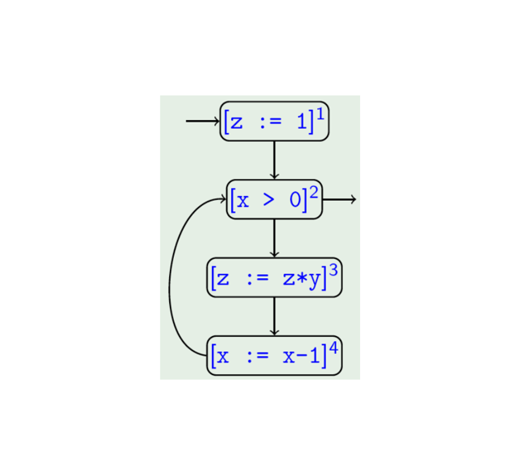

# 数据流分析
:::important
&emsp;&emsp;`数据流分析`推导`数据`<u>沿着程序执行路径</u>`流动`的信息。
:::

## 分类
| **分类依据**       | **具体分类**               | **简要解释**                               |
| ------------------ | -------------------------- | ------------------------------------------ |
| 依据语句顺序       | `流敏感`分析               | `考虑程序语句的执行顺序`                   |
|                    | `流不敏感`分析             | `不考虑语句执行顺序`                       |
| 依据流的方向       | `前向`分析                 | 从程序入口开始，沿着执行路径向出口方向分析 |
|                    | `后向`分析                 | 从程序出口开始，逆着执行路径向入口方向分析 |
| 依据路径的量化信息 | `May` (Union) 分析         | 考虑程序所有**可能**执行的路径             |
|                    | `Must` (Intersection) 分析 | 考虑程序**必然**执行的路径                 |
| 依据对过程的处理   | 过程内分析                 | 仅分析单个过程（函数/方法）内部的逻辑      |
|                    | 过程间分析                 | 分析多个过程间的调用关系                   |

## 命令式程序语言 $\mathrm{WHILE}$
&emsp;&emsp;**在保证分析有效性的前提下，为了降低分析复杂度**，通常会定义一种简化抽象的语言作为程序分析对象，从而剥离无关细节，避免陷入真实程序设计语言的细节泥潭。这里给出一种简单命令式语言（无过程或高级数据结构）—— $\mathrm{WHILE}$ 语言。

### 语法
| Category                   | Domain                                       | Meta variable |
| -------------------------- | -------------------------------------------- | ------------- |
| $Numbers$                  | $\mathbb{Z} = \{0, 1, -1, \dots\}$           | $z$           |
| $Truth$ $values$           | $\mathbb{B} = \{\text{true}, \text{false}\}$ | $t$           |
| $Variables$                | $\text{Var} = \{x, y, \dots\}$               | $x$           |
| $Arithmetic$ $expressions$ | $AExp$                                       | $a$           |
| $Boolean$ $expressions$    | $BExp$                                       | $b$           |
| $Commands$ $(statements)$  | $Cmd$                                        | $c$           |

| 类别                            | 语法定义                                                                                                                            | 所属集合 |
| ------------------------------- | ----------------------------------------------------------------------------------------------------------------------------------------------- | -------- |
| Arithmetic expressions ($AExp$) | $a ::= z \mid x \mid a_1+a_2 \mid a_1-a_2 \mid a_1*a_2 \in AExp$                                                                                | $AExp$   |
| Boolean expressions ($BExp$)    | $b ::= t \mid a_1=a_2 \mid a_1>a_2 \mid \neg b \mid b_1\land b_2 \mid b_1\lor b_2 \in BExp$                                                     | $BExp$   |
| Commands (statements, $Cmd$)    | $c ::= \text{skip} \mid x := a \mid c_1;c_2 \mid \text{if}\ b\ \text{then}\ c_1\ \text{else}\ c_2 \mid \text{while}\ b\ \text{do}\ c \in Cmd$ | $Cmd$    |

### 示例
&emsp;&emsp;下面是一个 $\mathrm{WHILE}$ 语言示例：
$$
\begin{align*}
    & x := 6; \\
    & y := 7; \\
    & z := 0; \\
    & \text{while}\ x > 0\ \text{do} \\
    & \quad x := x - 1; \\
    & \quad v := y; \\
    & \quad \text{while}\ v > 0\ \text{do} \\
    & \quad \quad v := v - 1; \\
    & \quad \quad z := z + 1 \\
\end{align*}
$$

## 控制流表示
### 打标签的程序（Labelled Programs）
:::important
&emsp;&emsp;为了标注分析信息所附着的`位置`信息，通常会为程序的每一条可执行语句、控制结构的关键节点（如循环判断、分支判断点）分配`唯一的标签`（$Label$）。
:::

&emsp;&emsp;对于 $\mathrm{WHILE}$ 语言，数据流信息附着于 $skip$ `语句`、`赋值语句`、`条件测试语句`以及`循环语句`。即：

$$
\begin{align*}
    & a ::= z \mid x \mid a_1+a_2 \mid a_1-a_2 \mid a_1*a_2 \in AExp \\
    & b ::= t \mid a_1=a_2 \mid a_1>a_2 \mid \neg b \mid b_1\land b_2 \mid b_1\lor b_2 \in BExp \\
    & c ::= \textcolor{red}{[\text{skip}]^l} \mid \textcolor{red}{[x := a]^l} \mid c_1;c_2 \mid \text{if}\ \textcolor{red}{[b]^l}\ \text{then}\ c_1\ \text{else}\ c_2 \mid \text{while}\ \textcolor{red}{[b]^l}\ \text{do}\ c \in Cmd
\end{align*}
$$

:::tip
&emsp;&emsp;这里注意 $c_1;c_2$ 作为`顺序复合语句`，不需要标注，因为其中的 $c_1$ 和 $c_2$ 本身包含标签。
:::

:::important
&emsp;&emsp;对于程序 $c$ 中被打标签的片段称为`块`，记作 $Blk_c$。
:::

&emsp;&emsp;对于前面的[示例代码](https://eiskola.github.io/posts/ppa/1-%E6%95%B0%E6%8D%AE%E6%B5%81%E5%88%86%E6%9E%90/10-%E5%9F%BA%E7%A1%80/#%E7%A4%BA%E4%BE%8B)，对其标注标签后：

$$
\begin{align*}
& \textcolor{red}{[\text{x} := 6]^1}; \\
& \textcolor{red}{[\text{y} := 7]^2}; \\
& \textcolor{red}{[\text{z} := 0]^3}; \\
& \text{while}\ \textcolor{red}{[\text{x} > 0]^4}\ \text{do} \\
& \quad \textcolor{red}{[\text{x} := \text{x} - 1]^5}; \\
& \quad \textcolor{red}{[\text{v} := \text{y}]^6}; \\
& \quad \text{while}\ \textcolor{red}{[\text{v} > 0]^7}\ \text{do} \\
& \quad \quad \textcolor{red}{[\text{v} := \text{v} - 1]^8}; \\
& \quad \quad \textcolor{red}{[\text{z} := \text{z} + 1]^9} \\
\end{align*}
$$

### 控制流表示
:::important
&emsp;&emsp;每个打标签的语句有一个`单入口`（$\mathrm{initial}\ \mathrm{labels}$）和可能的`多个出口`（$\mathrm{final}\ \mathrm{labels}$）。
:::

#### $\mathrm{init}$ 映射
&emsp;&emsp;对于程序语句存在映射：
$$
\mathrm{init}:\ Cmd \rightarrow Lab
$$
其中，$Cmd$ 表示`程序中的语句集合`，$Lab$ 表示`标签集合`。$\mathrm{init}$ 映射是一个`全函数`，即 $\forall c \in Cmd,\ \exist l \in Lab$ 使得 $\mathrm{init}(c) = l$，其中 $l$ 表示语句 $c$ 的`唯一入口`。

&emsp;&emsp;针对 $\mathrm{WHILE}$ 语言，定义 $\mathrm{init}$ 映射为：
$$
\begin{align}
    & \mathrm{init}([\text{skip}]^l) &:= l \\
    & \mathrm{init}([x := a]^l) &:= l \\
    & \mathrm{init}(c_1; c_2) &:= \textcolor{red}{\mathrm{init}(c_1)} \\
    & \mathrm{init}(\text{if}\ [b]^l\ \text{then}\ c_1\ \text{else}\ c_2) &:= l \\
    & \mathrm{init}(\text{while}\ [b]^l\ \text{do}\ c) &:= l \\
\end{align}
$$

其中，$(3)$ 表示复合语句应`递归地`获取该复合语句第一条语句的入口作为整个符合语句的入口。

#### $\mathrm{final}$ 映射
&emsp;&emsp;此外，程序语句存在映射：
$$
\mathrm{final}:\ Cmd \rightarrow \textcolor{red}{2^{Lab}}
$$
:::tip
&emsp;&emsp;这里的 $2^{Lab}$ 表示 $Lab$ 标签集合的`幂集`，其每个元素均为 $Lab$ 集合的子集，即 $\forall l \in 2^{Lab},\ l \subseteq Lab$。
:::
其中，$Cmd$ 表示程序中的语句集合，$Lab$ 表示标签集合。$\mathrm{final}$ 映射同样是一个全函数，$\forall c \in Cmd, \exist l \in 2^{Lab}$ 使得 $\mathrm{final}(c) = l$，其中 $l$ 表示语句 $c$ 所有可能的`出口集合`。

&emsp;&emsp;对于 $\mathrm{WHILE}$ 语言，定义 $\mathrm{final}$ 映射为：
$$
\begin{align}
    & \mathrm{final}([\text{skip}]^l) &:= \{l\} \\
    & \mathrm{final}([x := a]^l) &:= \{l\} \\
    & \mathrm{final}(c_1; c_2) &:= \textcolor{red}{\mathrm{final}(c_2)} \\
    & \mathrm{final}(\text{if}\ [b]^l\ \text{then}\ c_1\ \text{else}\ c_2) &:= \textcolor{red}{\mathrm{final}(c_1) \cup \mathrm{final}(c_2)} \\
    & \mathrm{final}(\text{while}\ [b]^l\ \text{do}\ c) &:= \textcolor{red}{\{l\}} \\
\end{align}
$$

需要注意第 $(10)$ 条，对于循环语句，跳出循环前要判断循环条件 $b$ 不成立。

#### （控制）流关系
:::important
&emsp;&emsp;前面定义了程序语句的位置标签、$\mathrm{init}$ 与 $\mathrm{final}$ 映射，于是可以定义程序`（控制）流关系`：
$$
\mathrm{flow}(c) \subseteq Lab \times Lab
$$
其中，$Lab \times Lab$ 即`笛卡尔积`。对于笛卡尔积 $A \times B$ 有， $\forall <a, b> \in A \times B$ ，其中 $a \in A$ 且 $b \in B$。

&emsp;&emsp;对于 $\mathrm{flow}(c)$ ，$\forall <l, l^{'}> \in \mathrm{flow}(c)$ ，则 $<l, l^{'}>$ 表示在程序语句 $c$ 中，存在控制流从位置标签 $l$ 流向了 $l^{'}$。
:::

&emsp;&emsp;对于 $\mathrm{WHILE}$ 语言，定义 $\mathrm{flow}$ 为：
$$
\begin{align}
    & \mathrm{flow}([\text{skip}]^l) := \emptyset \\
    & \mathrm{flow}([x := a]^l) := \emptyset \\
    & \mathrm{flow}(c_1; c_2) := \mathrm{flow}(c_1) \cup \mathrm{flow}(c_2) \cup \textcolor{red}{\{ (l, \mathrm{init}(c_2)) \mid l \in \mathrm{final}(c_1) \}} \\
    & \mathrm{flow}(\text{if}\ [b]^l\ \text{then}\ c_1\ \text{else}\ c_2) := \mathrm{flow}(c_1) \cup \mathrm{flow}(c_2) \cup \textcolor{red}{\{ (l, \mathrm{init}(c_1)), (l, \mathrm{init}(c_2)) \}} \\
    & \mathrm{flow}(\text{while}\ [b]^l\ \text{do}\ c) := \mathrm{flow}(c) \cup \textcolor{red}{\{ (l, \mathrm{init}(c)) \} \cup \{ (l', l) \mid l' \in \mathrm{final}(c) \}} \\
\end{align}
$$

:::tip
&emsp;&emsp;关注标红部分，对于`顺序复合语句` $c_1;c_2$，需要增加从语句 $c_1$ 到 $c_2$ 的控制流边；对于`条件判断语句` $\text{if}\ [b]^l\ \text{then}\ c_1\ \text{else}\ c_2$ 需要增加由`判断条件` $[b]^l$ 到语句 $c_1$ 以及 `判断条件` $[b]^l$ 到语句 $c_2$ 的控制流边；对于`循环判断语句` $\text{while}\ [b]^l\ \text{do}\ c$ 则不仅需要添加`判断条件` $[b]^l$ 到语句 $c$ 的控制流边，还需添加语句 $c$ 所有可能出口到判断条件 $[b]^l$ 的控制流边。
:::

#### 示例
$$
\begin{align*}
    c = &[z := 1]^1; \\
    &\text{while}\ [x > 0]^2\ \text{do} \\
    &\quad [z := z*y]^3; \\
    &\quad [x := x-1]^4
\end{align*}
$$

计算 $\mathrm{init}$、$\mathrm{final}$ 映射以及控制流关系：
$$
\begin{align*}
    & \mathrm{init}(c) &= &1 \\
    & \mathrm{final}(c) &= &\{2\} \\
    & \mathrm{flow}(c) &= &\{(1, 2), (2, 3), (3, 4), (4, 2)\} \\
\end{align*}
$$

从而根据上述信息可以构建控制流图：

:::note
&emsp;&emsp;数据流分析本质上都是把程序看成是一个图，分析算法都是基于图表示的。
:::