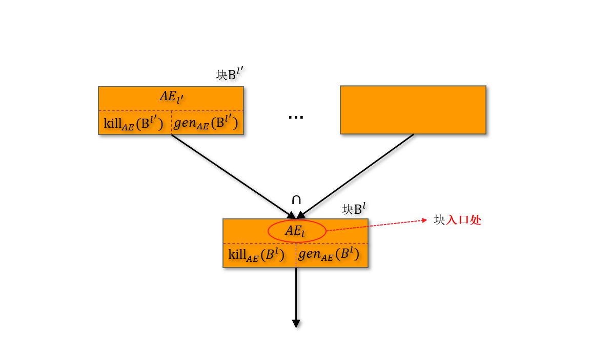

# 可用表达式分析
&emsp;&emsp;`可用表达式分析`（$\mathrm{Available\ Expression}$）是一种`前向`、`Must 类型`的`流敏感`数据流分析，用于判断程序中的某个点上，哪些`表达式`的计算结果在后续执行中可能被使用且值不会改变。

## 核心定义
:::important
&emsp;&emsp;`可用表达式分析`确定每个程序点处哪些表达式之前肯定已被计算出来了，且在计算出来后`所有`到达该程序点的路径上`再也未被修改过`。
:::

&emsp;&emsp;根据定义，表达式 $e$ 在被计算出来后，所有到达程序点 $p$ 的路径上，表达式 $e$ 中的`所有变量都未被修改`，这样的表达式 $e$ 是程序点 $p$ 处的可用表达式。需要补充一点，`所有`可能到达程序点 $p$ 的执行路径中，`都要有`已被计算的表达式 $e$ 的"有效结果"，但是`不同路径上，允许计算得到的结果不同`。 

:::tip
&emsp;&emsp;可用表达式分析是`公共子表达式消除`的基础，后者使用保存了公共子表达式最新值的变量来替换公共子表达式，这常用于编译优化中。
:::

### 示例
&emsp;&emsp;举个例子：
$$
\begin{align*}
    &[x := \textcolor{red}{a+b}]^1; \\
    &[y := a*b]^2; \\
    &\text{while } [y > \textcolor{red}{a+b}]^3 \text{ do} \\
    &\quad [a := a+1]^4; \\
    &\quad [x := \textcolor{red}{a+b}]^5 \\
\end{align*}
$$

&emsp;&emsp;在这个例子中，关注程序点 `3` 处，表达式 $a+b$ 是可用表达式。在到达程序点 `3` 的所有路径：$1\rightarrow 2\rightarrow 3$ 与 $4\rightarrow 5\rightarrow 3$，在这两个路径上都计算了表达式 $a+b$，且由于在程序点 `4` 处修改了表达式 $a+b$ 所包含的变量 $a$，两条路径上的表达式 $a+b$ 的"有效计算结果"并不相同。

&emsp;&emsp;而关注程序点 `5` 处，其必经路径 $4\rightarrow 5$ 上变量 $a$ 被修改，因此表达式 $a+b$ 在程序点 `5` 处并非可用表达式。

&emsp;&emsp;经过上面的分析，程序可以优化为：
$$
\begin{align*}
    &[x := a+b]^1; \\
    &[y := a*b]^2; \\
    &\text{while } [y > \textcolor{red}{x}]^3 \text{ do} \\
    &\quad [a := a+1]^4; \\
    &\quad [x := a+b]^5 \\
\end{align*}
$$

## 形式化描述
### $\mathrm{kill}$ 函数
:::important
&emsp;&emsp;如果表达式 $a$ 中任何变量在`块` $B$ 中`被修改了`，则称表达式 $a$ 在块$B$ 中被 $\mathrm{kill}$ 了。
:::
:::tip
&emsp;&emsp;`块` 的定义见[数据流分析基础](https://eiskola.github.io/posts/ppa/1-%E6%95%B0%E6%8D%AE%E6%B5%81%E5%88%86%E6%9E%90/10-%E6%95%B0%E6%8D%AE%E6%B5%81%E5%88%86%E6%9E%90/#%E6%89%93%E6%A0%87%E7%AD%BE%E7%9A%84%E7%A8%8B%E5%BA%8Flabelled-programs)。
:::

&emsp;&emsp;$\mathrm{kill}$ 函数定义为：
$$
\mathrm{kill}_{AE}: Blk_c \rightarrow 2^{CExp_c}
$$

&emsp;&emsp;其中，下标 $AE$ 即表达式（$Arithmetic$ $Expressions$），$Blk_c$ 表示程序 $c$ 中的`块集合`，$CExp_c$ 表示程序 $c$ 中的`复杂算术表达式集合`——$CExp$ 是 $AExp$ 子集，表示含有算术操作的表达式，即：
$$
c ::= a_1+a_2 \mid a_1-a_2 \mid a_1*a_2 \in CExp
$$

&emsp;&emsp;对于 $\mathrm{WHILE}$ 语言，$\mathrm{kill}$ 函数定义为：
$$
\begin{align}
    & \mathrm{kill}_{AE}([skip]^l) &:= &\empty \\
    & \mathrm{kill}_{AE}([x := a]^l) &:= &\textcolor{red}{\{a^{'} \in CExp_c | x \in Var_{a^{'}}\}} \\
    & \mathrm{kill}_{AE}([b]^l) &:= &\empty \\
\end{align}
$$

&emsp;&emsp;其中，$Var_e$ 表示表达式 $e$ 中的所有变量。$(2)$ 表示，对于`赋值语句` $[x := a]^l$，包含变量 $x$ 的`所有表达式`都被 $\mathrm{kill}$ 了。

### $\mathrm{genetate}$ 函数
:::important
&emsp;&emsp;如果表达式 $a$ 在块 $B$ 中被`计值`了且 $a$ 中`所有变量未被修改`，则称表达式 $a$ 在块 $B$ 中被 $\mathrm{generate}$ 了。

&emsp;&emsp;其中，"被计值"表示`表达式被执行计算并得到结果的过程`。需要注意的是，表达式被计值还不能认为被 $\mathrm{generate}$，还需要满足表达式中的变量未被修改，如：
$$
x := x+1;
$$

&emsp;&emsp;在这条赋值语句中，表达式 $x+1$ 被计值了，但是表达式中包含被赋值的变量，于是在这条赋值语句执行后，表达式 $x+1$ 的值实际上已经被修改了，所以不能认为被 $\mathrm{generate}$ 了。
:::

&emsp;&emsp;$\mathrm{generate}$ 函数定义为：
$$
\mathrm{gen}_{AE}: Blk_c \rightarrow 2^{CExp_c}
$$

&emsp;&emsp;在 $\mathrm{WHILE}$ 语言中，$\mathrm{generate}$ 映射定义为：
$$
\begin{align}
    & \mathrm{gen}_{AE}([skip]^l) &:= &\empty \\
    & \mathrm{gen}_{AE}([x := a]^l) &:= &\textcolor{red}{\{a | x \notin Var_a\}} \\
    & \mathrm{gen}_{AE}([b]^l) &:= &\textcolor{red}{\{CExp_b\}} \\
\end{align}
$$

### $\mathrm{kill}_{AE}$ / $\mathrm{gen}_{AE}$ 示例
&emsp;&emsp;还是上面的例子：
$$
\begin{align*}
    c = &[x := {a+b}]^1; \\
    &[y := a*b]^2; \\
    &\text{while } [y > {a+b}]^3 \text{ do} \\
    &\quad [a := a+1]^4; \\
    &\quad [x := {a+b}]^5 \\
\end{align*}
$$

&emsp;&emsp;首先，$CExp_c = \{a+b, a*b, a+1\}$，于是根据 $\mathrm{kill}_{AE}$ 和 $\mathrm{gen}_{AE}$ 定义有：

| $Lab_c$ | $\mathrm{kill}_\text{AE}(B')$ | $\mathrm{gen}_\text{AE}(B')$ |
| :------ | :---------------------------- | :--------------------------- |
| 1       | $\emptyset$                   | $\{a+b\}$                    |
| 2       | $\emptyset$                   | $\{a*b\}$                    |
| 3       | $\emptyset$                   | $\{a+b\}$                    |
| 4       | $\{a+b, a*b, a+1\}$           | $\emptyset$                  |
| 5       | $\emptyset$                   | $\{a+b\}$                    |

&emsp;&emsp;根据定义 $(5)$，位置标签 `4` 处不能 $\mathrm{generate}$ 表达式 $a+1$。

### 建立数据流方程组
&emsp;&emsp;分析过程本身通过建立一个`数据流方程组`来定义。对于可用表达式分析，下面是基于控制流的数据流方程`形式化定义`：

&emsp;&emsp;对程序命令集合 $Cmd$ 中的命令语句 $c$，有：
$$
\text{AE}_l = 
\begin{cases} 
    \emptyset & \text{if } \textcolor{red}{l = \text{init}(c)} \\
    \textcolor{red}{\bigcap} \{ \varphi_{l'}(\text{AE}_{l'}) \mid (l', l) \in \text{flow}(c) \} & \text{otherwise}
\end{cases}
$$
:::note
&emsp;&emsp;这里 $(l', l) \in \text{flow}(c)$ 表明 $l'$ 是 $l$ 前驱。
:::

&emsp;&emsp;其中，映射 $\varphi_{l'}: 2^{CExp_c}\rightarrow 2^{CExp_c}$ 定义为：
$$
\varphi_{l'}(A) := (A \setminus \text{kill}_\text{AE}(B^{l'})) \cup \text{gen}_\text{AE}(B^{l'})
$$

&emsp;&emsp;这里的 $\setminus$ 表示`集合的差运算符`。映射 $\varphi_{l'}(A)$ 表示从集合 $A$ 中先移除属于 $\mathrm{kill}_{AE}$ 中的元素，再加入 $\mathrm{gen}_{AE}$ 中的元素，即"`先杀死失效表达式，再加入新生成表达式`"。

:::important
&emsp;&emsp;需要特别注意，$\text{AE}_l$ 表示`块` $B^l$ 的`入口处`的可用表达式集合，而对于`程序入口处`，即 $l = \mathrm{init}(c)$，可用表达式集合 $\mathrm{AE}_l = \empty$。
:::

## 示例
&emsp;&emsp;还是前面的代码示例：
$$
\begin{align*}
    c = &[x := {a+b}]^1; \\
    &[y := a*b]^2; \\
    &\text{while } [y > {a+b}]^3 \text{ do} \\
    &\quad [a := a+1]^4; \\
    &\quad [x := {a+b}]^5 \\
\end{align*}
$$

&emsp;&emsp;我们已经求解过 $\mathrm{kill}_{AE}$ 和 $\mathrm{gen}_{AE}$：
| $Lab_c$ | $\mathrm{kill}_\text{AE}(B')$ | $\mathrm{gen}_\text{AE}(B')$ |
| :------ | :---------------------------- | :--------------------------- |
| 1       | $\emptyset$                   | $\{a+b\}$                    |
| 2       | $\emptyset$                   | $\{a*b\}$                    |
| 3       | $\emptyset$                   | $\{a+b\}$                    |
| 4       | $\{a+b, a*b, a+1\}$           | $\emptyset$                  |
| 5       | $\emptyset$                   | $\{a+b\}$                    |

&emsp;&emsp;根据可用表达式的`数据流方程组形式化定义`有：
$$
\begin{align*}
    & \mathrm{AE}_1 = \empty \\
    & \mathrm{AE}_2 = \varphi_1(\mathrm{AE}_1) =  \mathrm{AE}_1 \cup \{a+b\} \\
    & \mathrm{AE}_3 = \varphi_2(\mathrm{AE}_2) \cap \varphi_5(\mathrm{AE}_5) = (\mathrm{AE}_2 \cup \{a*b\}) \cap (\mathrm{AE}_5 \cup \{a+b\}) \\
    & \mathrm{AE}_4 = \varphi_3(\mathrm{AE}_3) = \mathrm{AE}_3 \cup \{a+b\} \\
    & \mathrm{AE}_5 = \varphi_4(\mathrm{AE}_4) = \mathrm{AE}_4 \setminus \{a+b, a*b, a+1\} \\
\end{align*}
$$

&emsp;&emsp;这类`集合方程组`遵循`迭代求解算法`，从初始值开始，反复迭代更新各程序点的集合，直到所有集合不再变化，即收敛。迭代求解上面的方程组：
1. 第1次迭代：
   - $\mathrm{AE}_1$ 固定为 $\emptyset$（入口点不更新）。
   - $\mathrm{AE}_2 = \varphi_1(\mathrm{AE}_1) = \mathrm{AE}_1 \cup \{a+b\} = \emptyset \cup \{a+b\} = \{a+b\}$。
   - $\mathrm{AE}_5$ 依赖 $\mathrm{AE}_4$（当前 $\mathrm{AE}_4 = U$）：  
     $\mathrm{AE}_5 = \varphi_4(\mathrm{AE}_4) = \mathrm{AE}_4 \setminus \{a+b, a*b, a+1\} = U \setminus U = \emptyset$。
   - $\mathrm{AE}_3$ 依赖 $\mathrm{AE}_2$ 和 $\mathrm{AE}_5$：  
     $\mathrm{AE}_3 = (\mathrm{AE}_2 \cup \{a*b\}) \cap (\mathrm{AE}_5 \cup \{a+b\}) = (\{a+b\} \cup \{a*b\}) \cap (\emptyset \cup \{a+b\}) = \{a+b, a*b\} \cap \{a+b\} = \{a+b\}$。
   - $\mathrm{AE}_4 = \varphi_3(\mathrm{AE}_3) = \mathrm{AE}_3 \cup \{a+b\} = \{a+b\} \cup \{a+b\} = \{a+b\}$。
    本次迭代后：$\mathrm{AE}_2=\{a+b\}$，$\mathrm{AE}_3=\{a+b\}$，$\mathrm{AE}_4=\{a+b\}$，$\mathrm{AE}_5=\emptyset$（均发生变化）。

1. 第2次迭代：
   - $\mathrm{AE}_2$ 基于 $\mathrm{AE}_1$ 不变：仍为 $\{a+b\}$。
   - $\mathrm{AE}_4$ 基于 $\mathrm{AE}_3 = \{a+b\}$：仍为 $\{a+b\}$。
   - $\mathrm{AE}_5$ 基于 $\mathrm{AE}_4 = \{a+b\}$：  
     $\mathrm{AE}_5 = \{a+b\} \setminus \{a+b, a*b, a+1\} = \emptyset$（不变）。
   - $\mathrm{AE}_3$ 基于 $\mathrm{AE}_2 = \{a+b\}$ 和 $\mathrm{AE}_5 = \emptyset$：结果仍为 $\{a+b\}$（不变）。

&emsp;&emsp;第`2`次迭代后，所有集合均未变化，达到**收敛**。收敛后的集合即为方程组的解：
$$
\begin{align*}
    & \mathrm{AE}_1 = \emptyset \\
    & \mathrm{AE}_2 = \{a+b\} \\
    & \mathrm{AE}_3 = \{a+b\} \\
    & \mathrm{AE}_4 = \{a+b\} \\
    & \mathrm{AE}_5 = \emptyset \\
\end{align*}
$$

&emsp;&emsp;注意：方程组的解不一定唯一，不唯一则`选择最大的`，可用表达式集合越大，可做的优化也就更多。

:::note
&emsp;&emsp;显然，可用表达式分析：`流敏感`、`前向分析`以及`Must分析`。
:::