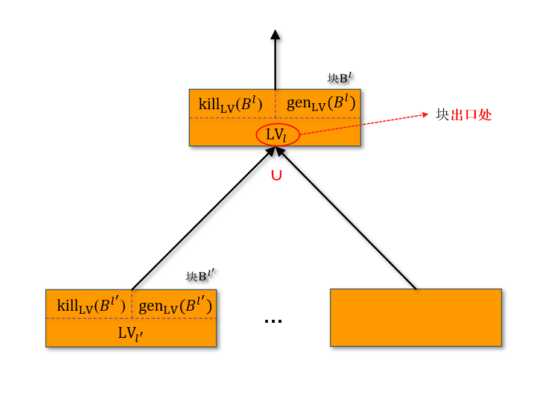
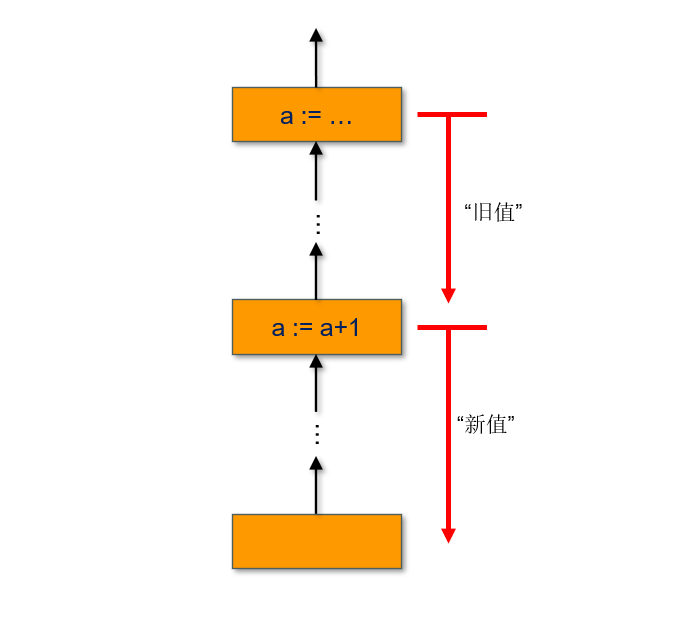

# 活跃变量分析
&emsp;&emsp;`活跃变量分析`（$\mathrm{Live\ Variable}$）是一种`后向`、`May 类型`的`流敏感`数据流分析，用于判断程序中的某个点上，哪些`变量`的值在后续执行中可能被使用（即"`活跃`"）。

## 核心定义
:::important
&emsp;&emsp;`活跃变量分析`为每个程序块确定哪些变量在该块`出口处` `可能`是`活跃的`。

&emsp;&emsp;注意，这里的`块`是[数据流分析基础](https://eiskola.github.io/posts/ppa/1-%E6%95%B0%E6%8D%AE%E6%B5%81%E5%88%86%E6%9E%90/10-%E5%9F%BA%E7%A1%80/#%E6%89%93%E6%A0%87%E7%AD%BE%E7%9A%84%E7%A8%8B%E5%BA%8Flabelled-programs)中定义的，并非常用的类似程序基本块的概念。
:::

&emsp;&emsp;其中，"`活跃变量`"的概念定义为：如果`存在`一条路径从该`块`到该`变量的使用处`都`不会重新定义`该变量的值，则称该变量是"活跃的"。即在程序某点 $p$ 到程序出口的`某条可能执行路径`上，变量 $x$ 的值被使用，且在被使用前未被重新赋值。

&emsp;&emsp;此外，需要特别指出的是，在整个`程序的出口处`，程序中的`所有变量`被认为是`活跃的`。

:::tip
&emsp;&emsp;活跃变量分析是编译优化的重要基础，常用于`寄存器分配`、`死代码消除`等编译优化过程中。
:::

### 示例
&emsp;&emsp;举个例子：
$$
\begin{align*}
    &[x := 2]^1; \\
    &[y := 4]^2; \\
    &[x := 1]^3; \\
    &\text{if } [y > 0]^4 \text{ then} \\
    &\quad [z := x]^5 \\
    &\text{else} \\
    &\quad [z := y*y]^6; \\
    &[x := z]^7 \\
\end{align*}
$$

&emsp;&emsp;在这个例子中，变量 $x$ 在标签`1`出口处不活跃，因为在标签`1`出口到变量 $x$ 被使用（标签`5`处）间的唯一执行路径上，变量 $x$ 在标签`3`处被重新定义；变量 $y$ 在标签`2`出口处活跃，因为在标签`2`出口到变量 $y$ 被使用处（标签`4`和标签`6`）都没有被重新定义，实际上这里只要存在一条路径满足即可，即标签`2`到标签`4`之间变量 $y$ 没有被重新定义就足够证明其活跃性；变量 $x$ 在标签`3`出口处活跃，分析类似；变量 $z$ 在标签`5`和`6`出口处都是活跃的，不做分析。

&emsp;&emsp;经过上面的分析，可能对程序进行优化——去除赋值语句 $[x := 2]^1$。

## 形式化描述
### $\mathrm{kill}$ 函数
:::important
&emsp;&emsp;`赋值语句`中被赋值的变量会被 $\mathrm{kill}$。
:::

&emsp;&emsp;于是在 $\mathrm{WHILE}$ 语言中，定义函数 $\mathrm{kill}_{LV}: Blk_c \rightarrow 2^{Var_c}$：

$$
\begin{align}
    & \text{kill}_\text{LV}([\text{skip}]^l) &:= & \emptyset \\
    & \textcolor{red}{\text{kill}_\text{LV}([x := a]^l)} &\textcolor{red}{:=} & \textcolor{red}{\{x\}} \\
    & \text{kill}_\text{LV}([b]^l) &:= & \emptyset \\
\end{align}
$$

### $\mathrm{genetate}$ 函数
:::important
&emsp;&emsp;读变量会 $\mathrm{generate}$ 活跃变量。
:::

&emsp;&emsp;在 $\mathrm{WHILE}$ 语言中，定义函数 $\mathrm{gen}_{LV}: Blk_c \rightarrow 2^{Var_c}$：
$$
\begin{align}
    & \text{gen}_\text{LV}([\text{skip}]^l) &:= & \emptyset \\
    & \textcolor{red}{\text{gen}_\text{LV}([x := a]^l)} &\textcolor{red}{:=} & \textcolor{red}{\text{Var}_a} \\
    & \textcolor{red}{\text{gen}_\text{LV}([b]^l)} &\textcolor{red}{:=} & \textcolor{red}{\text{Var}_b} \\
\end{align}
$$

### $\mathrm{kill}_{LV}$ / $\mathrm{gen}_{LV}$ 示例
&emsp;&emsp;还是上面的例子：
$$
\begin{align*}
    c = &[x := 2]^1; \\
    &[y := 4]^2; \\
    &[x := 1]^3; \\
    &\text{if } [y > 0]^4 \text{ then} \\
    &\quad [z := x]^5 \\
    &\text{else} \\
    &\quad [z := y*y]^6; \\
    &[x := z]^7 \\
\end{align*}
$$

&emsp;&emsp;首先程序 $c$ 中变量集合 $Var_c = \{x, y, z\}$，根据上面 $\mathrm{kill}_{LV}$ 与 $\mathrm{gen}_{LV}$ 定义有：

| \( l \in Lab_c \) | \( \text{kill}_\text{LV}(B^l) \) | \( \text{gen}_\text{LV}(B^l) \) |
| :---------------- | :------------------------------- | :------------------------------ |
| 1                 | \( \{x\} \)                      | \( \emptyset \)                 |
| 2                 | \( \{y\} \)                      | \( \emptyset \)                 |
| 3                 | \( \{x\} \)                      | \( \emptyset \)                 |
| 4                 | \( \emptyset \)                  | \( \{y\} \)                     |
| 5                 | \( \{z\} \)                      | \( \{x\} \)                     |
| 6                 | \( \{z\} \)                      | \( \{y\} \)                     |
| 7                 | \( \{x\} \)                      | \( \{z\} \)                     |

### 建立数据流方程组
&emsp;&emsp;与可用表达式分析一样，活跃变量分析通过建立数据流方程组来形式化描述分析过程：

&emsp;&emsp;对程序命令集合 $Cmd$ 中的命令语句 $c$，有：
$$
\text{LV}_l = 
\begin{cases} 
    \text{Var}_c & \text{if } \textcolor{red}{l \in \text{final}(c)} \\
    \textcolor{red}{\bigcup} \{ \varphi_{l'}(\text{LV}_{l'}) \mid (l, l') \in \text{flow}(c) \} & \text{otherwise}
\end{cases}
$$

:::note
&emsp;&emsp;这里 $(l, l') \in \text{flow}(c)$ 表明 $l'$ 是 $l$ 后继。
:::

&emsp;&emsp;其中，映射 $\varphi_{l'}: 2^{Var_c}\rightarrow 2^{Var_c}$ 定义为：

$$
\varphi_{l'}(V) := (V \setminus \text{kill}_\text{LV}(B^{l'})) \cup \text{gen}_\text{LV}(B^{l'})
$$

&emsp;&emsp;这里的 $\setminus$ 表示`集合的差运算符`。映射 $\varphi_{l'}(V)$ 表示从集合 $V$ 中先移除属于 $\mathrm{kill}_{LV}$ 中的元素，再加入 $\mathrm{gen}_{LV}$ 中的元素。在反向分析过程中，移除属于 $\mathrm{kill}_{LV}$ 中的变量即是终止对该变量 "更早定义" 的活跃性追溯；加入 $\mathrm{gen}_{LV}$ 中的变量则启动对该变量 "更早定义" 的活跃性追溯。

:::important
&emsp;&emsp;需要特别注意，$\text{LV}_l$ 表示`块` $B^l$ 的`出口处`的活跃变量集合，而对于`程序出口处`，即 $l = \mathrm{final}(c)$，活跃变量集合 $\mathrm{LV}_l = Var_c$。
:::

### 如何处理 $a:=a+1$
&emsp;&emsp;在可用表达式分析的 $\mathrm{gen}_{AE}$ 函数中我们讨论过这个问题，但在这里的处理方式不同。可用表达式分析中，表达式 $a+1$ 被计值了，但是语句执行结束后表达式中的变量 $a$ 也被修改了，因此不能被 $\mathrm{generate}$；而在这里，赋值语句 $a := a+1$ 首先需要`先读变量` $a$，因此对于变量 $a$ 而言确实要将其加入 $\mathrm{gen}_{LV}$ 集合，然后`再写变量` $a$，同样要将其加入 $\mathrm{kill}_{LV}$ 集合。

&emsp;&emsp;假设块 $[a:a+1]^l$ 出口处的活跃变量集合 $LV_l = S$，于是根据映射 $\varphi_{l'}(V)$ 定义，在块 $[a:a+1]^l$ 入口处的活跃变量集合 $LV_l' = (S / \{a\}) \cup \{a\} = S$，也就是说活跃变量集合并没有变化。实际上，变量内涵发生了改变：对于变量 $a$ 而言，其"新值"的活跃性已经结束，而现在变量 $a$ 中"活跃"的是其"旧值"。

## 示例
&emsp;&emsp;前面的例子：
$$
\begin{align*}
    c = &[x := 2]^1; \\
    &[y := 4]^2; \\
    &[x := 1]^3; \\
    &\text{if } [y > 0]^4 \text{ then} \\
    &\quad [z := x]^5 \\
    &\text{else} \\
    &\quad [z := y*y]^6; \\
    &[x := z]^7 \\
\end{align*}
$$

&emsp;&emsp;于是根据 $\mathrm{kill}_{LV}$ 与 $\mathrm{gen}_{LV}$ 定义有：
| \( l \in Lab_c \) | \( \text{kill}_\text{LV}(B^l) \) | \( \text{gen}_\text{LV}(B^l) \) |
| :---------------- | :------------------------------- | :------------------------------ |
| 1                 | \( \{x\} \)                      | \( \emptyset \)                 |
| 2                 | \( \{y\} \)                      | \( \emptyset \)                 |
| 3                 | \( \{x\} \)                      | \( \emptyset \)                 |
| 4                 | \( \emptyset \)                  | \( \{y\} \)                     |
| 5                 | \( \{z\} \)                      | \( \{x\} \)                     |
| 6                 | \( \{z\} \)                      | \( \{y\} \)                     |
| 7                 | \( \{x\} \)                      | \( \{z\} \)                     |

&emsp;&emsp;建立数据流方程组：
$$
\begin{align*}
    \text{LV}_1 &= \varphi_2(\text{LV}_2) = \text{LV}_2 \setminus \{y\} \\
    \text{LV}_2 &= \varphi_3(\text{LV}_3) = \text{LV}_3 \setminus \{x\} \\
    \text{LV}_3 &= \varphi_4(\text{LV}_4) = \text{LV}_4 \cup \{y\} \\
    \text{LV}_4 &= \varphi_5(\text{LV}_5) \cup \varphi_6(\text{LV}_6) \\
    &= ((\text{LV}_5 \setminus \{z\}) \cup \{x\}) \cup ((\text{LV}_6 \setminus \{z\}) \cup \{y\}) \\
    \text{LV}_5 &= \varphi_7(\text{LV}_7) = (\text{LV}_7 \setminus \{x\}) \cup \{z\} \\
    \text{LV}_6 &= \varphi_7(\text{LV}_7) = (\text{LV}_7 \setminus \{x\}) \cup \{z\} \\
    \text{LV}_7 &= \{x, y, z\} \\
\end{align*}
$$

&emsp;&emsp;迭代求解可得：
$$
\begin{align*}
    \text{LV}_1 &= \emptyset \\
    \text{LV}_2 &= \{y\} \\
    \text{LV}_3 &= \{x, y\} \\
    \text{LV}_4 &= \{x, y\} \\
    \text{LV}_5 &= \{y, z\} \\
    \text{LV}_6 &= \{y, z\} \\
    \text{LV}_7 &= \{x, y, z\} \\
\end{align*}
$$