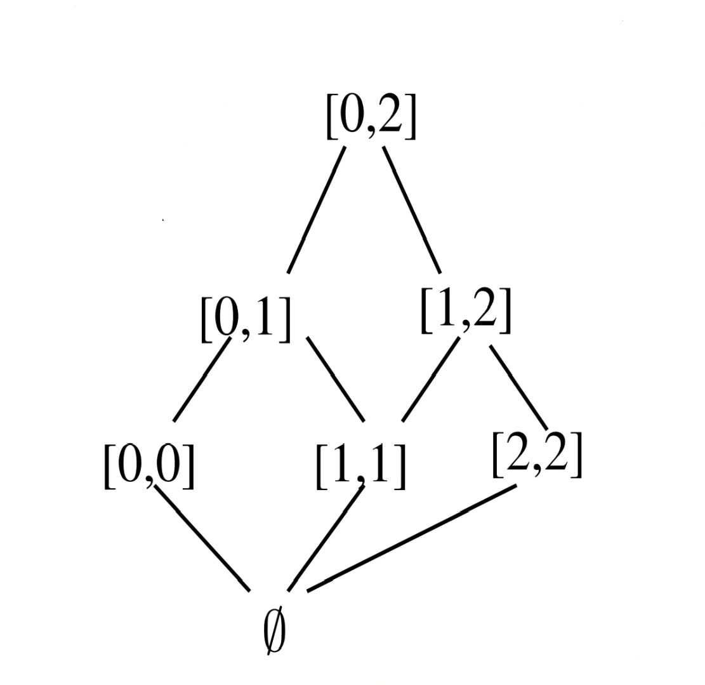
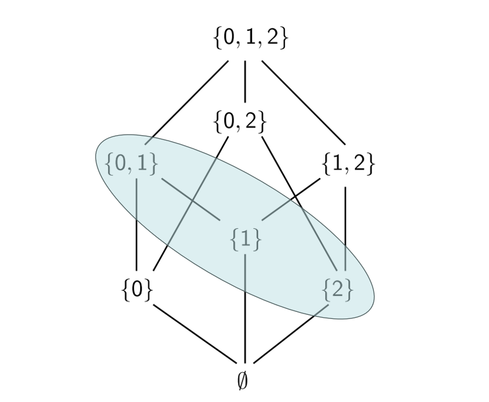
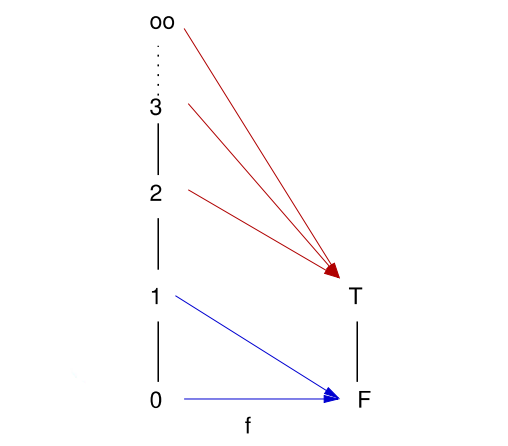
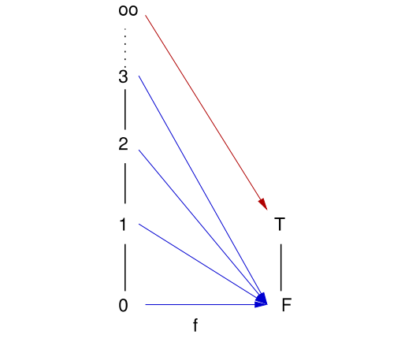
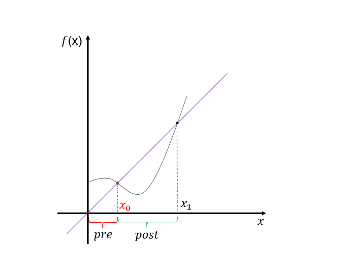
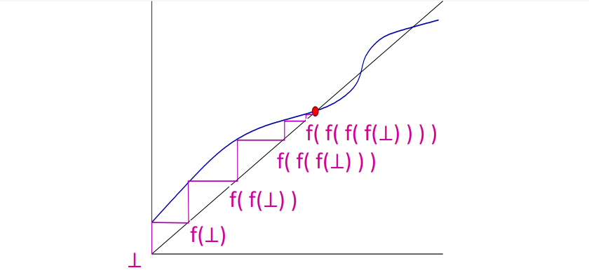

# 数据流分析共性问题
&emsp;&emsp;之前分别介绍了[[PPA/1-数据流分析/1.1-可用表达式分析]]和[[PPA/1-数据流分析/1.2-活跃变量分析]]两类经典的数据流分析实例，不难发现，它们的分析过程间存在`相似性`，都是基于`图的表示`，并通过`建立数据流方程组求解`的分析框架，这样统一的分析框架，为求解数据流方程组提供高效的通用算法提供了可能。

## 不同分析实例的相似性
&emsp;&emsp;我们可以比较可用表达式分析与活跃变量分析的数据流方程组形式化定义：
$$
\text{AE}_l = 
\begin{cases} 
    \emptyset & \text{if } \textcolor{red}{l = \text{init}(c)} \\
    \textcolor{red}{\bigcap} \{ \varphi_{l'}(\text{AE}_{l'}) \mid (l', l) \in \text{flow}(c) \} & \text{otherwise}
\end{cases}
$$

$$
\text{LV}_l = 
\begin{cases} 
    \text{Var}_c & \text{if } \textcolor{red}{l \in \text{final}(c)} \\
    \textcolor{red}{\bigcup} \{ \varphi_{l'}(\text{LV}_{l'}) \mid (l, l') \in \text{flow}(c) \} & \text{otherwise}
\end{cases}
$$

&emsp;&emsp;它们在表示上存在相似性，实际上我们可以定义一个统一的形式表达来定义这样的分析过程：
&emsp;&emsp;对于 $ c \in \text{Cmd}$ 且 $l \in \text{Lab}_c$，分析信息（$\mathrm{AI}$）由下面形式的方程描述：
$$
\text{AI}_l = \begin{cases} 
\iota & \text{if } l \in E \\
\bigsqcup \{ \varphi_{l'}(\text{AI}_{l'}) \mid (l', l) \in F \} & \text{otherwise}
\end{cases}
$$

&emsp;&emsp;其中：
  - 组合操作子 $\bigsqcup$ ：对应公式中的组合操作，有路径量化方式确定；
  - 块$B'$的迁移函数$\varphi_{l'}$：用于处理分析信息的迁移；
  - 流关系：$\text{flow}(c)$ 或 $\text{flow}^\text{R}(c)$（即 $\mathrm{flow}$ 关系的逆），对应公式中的 $(l', l) \in F$；
  - 端结点的标签集合$E$：$\{ \text{init}(c) \}$ 或 $\text{final}(c)$，用于界定公式中 $l \in E$ 的情况。

&emsp;&emsp;当 $F = \mathrm{flow(c)}$ 时属于`前向分析`的信息流；当 $F = \mathrm{flow^R(c)}$ 时属于后向分析的信息流。而组合操作子 $\sqcup$ 则根据路径上的`量化`方式，如可用表达式分析的 $\mathrm{Must}$ 类型使用 $\bigsqcup = \bigcap$，而如活跃变量分析的 $\mathrm{May}$ 类型则使用 $\bigsqcup = \bigcup$。

## 分析框架
&emsp;&emsp;不同的数据流分析实例在相同的形式化表达下构建数据流方程组，在相同的分析框架下，通过`不动点迭代`来求解数据流方程组。
1. 把`方程组的解`刻画为一个转换子的`不动点`；
2. 引入`偏序关系`来比较分析结果；
3. 建立`最小上界`或`最大下界`作为组合操作子；
4. 保证迁移函数的`单调性`；
5. 确保不动点迭代的`终止性`（满足递增链条件）；
6. 通过 $\mathrm{worklist}$ 算法来对不动点迭代进行优化。

# 理论基础
## 序理论（$\mathrm{Order\ Theory}$）
### 偏序（$\mathrm{Partial\ Order}$）
:::important
&emsp;&emsp;`偏序关系`是定义在集合 $D$ 上的一种`二元关系` $\sqsubseteq$，需要满足下面三个条件：
- 自反性：$\forall a \in D$ 有 $a \sqsubseteq a$；
- 传递性：若 $a \sqsubseteq b$ 且 $b \sqsubseteq c$，则 $a \sqsubseteq c$；
- 反对称性：若 $a \sqsubseteq b$ 且 $b \sqsubseteq a$，则 $a = b$.

&emsp;&emsp;若 $\sqsubseteq$ 构成集合 $D$ 上的偏序关系，则称 $(D, \sqsubseteq)$ 为`偏序集`（$\mathrm{Poset}$）。
:::

:::tip
&emsp;&emsp;设 $S$ 是一个非空集合，`二元关系` $R$ 是 $A$ 中元素的`有序对`（`二元序偶`）集合，即 $R \subseteq S\times S$（$S \times S$ 表示 $S$ 中所有的有序对 $<a, b>$ 的集合）；若 $<a, b> \in R$，则称"$a$ 与 $b$ 具有关系 $R$"，记作 $aRb$。
:::

&emsp;&emsp;不要混淆`偏序关系`与`偏序集`。两者都是集合，但偏序关系是"元素间的关系集合"，而偏序集则是"带关系的元素集合载体"，即前者描述一种关系，后者描述一个带有某种关系的集合。

:::warning
&emsp;&emsp;需要注意，偏序集中`并非所有元素都能够比较关系`，但是只要能够比较，就满足自反、传递以及反对称的规则。
:::

#### 示例
1. $(\mathbb{Z}, \le)$
2. $(\mathscr{P}(x), \subseteq)$，其中 $\mathscr{P}$ 表示`幂集`
3. $(\mathbb{Z}^2, \sqsubseteq)$，其中，$(a, b) \sqsubseteq (a', b') \Leftrightarrow a \ge a' \land  b \ge b'$

&emsp;&emsp;前面提到，偏序集中并非所有元素都能够比较关系，如 $(\mathscr{P}(\{1, 2\}), \subseteq)$ 中的元素 $\{1\}$ 和 $\{2\}$ 之间就不能进行比较。示例`3`表示了`区间包含`关系。

### 格（$\mathrm{lattice}$）
:::important
&emsp;&emsp;设`偏序集` $(D, \sqsubseteq)$，若集合 $D$ 中`任意两个元素` $a, b$ 都有`最小上界`（即上确界，$\mathrm{LUB}$）和`最大下界`（即下确界，$\mathrm{GLB}$），则称之为`格`，该格记作 $(D, \sqsubseteq, \sqcup, \sqcap)$。其中：

#### 最小上界：记为 $a\sqcup b$
&emsp;&emsp;$\forall a, b \in D$，存在唯一元素 $c \in D$，满足：
1. $a\sqsubseteq c$ 且 $b \sqsubseteq c$（即 $c$ 是 $a$ 和 $b$ 的上界）；
2. 若存在 $d \in D$ 使得 $a\sqsubseteq d$ 且 $b \sqsubseteq d$，则 $c \sqsubseteq d$（即 $c$ 是所有上界中最"小"的那个）.

#### 最大下界：记为 $a\sqcap b$
&emsp;&emsp;$\forall a, b \in D$，存在唯一元素 $c \in D$，满足：
1. $c\sqsubseteq a$ 且 $c \sqsubseteq b$（即 $c$ 是 $a$ 和 $b$ 的下界）；
2. 若存在 $d \in D$ 使得 $d\sqsubseteq a$ 且 $d \sqsubseteq b$，则 $d \sqsubseteq c$（即 $c$ 是所有上界中最"大"的那个）.
:::

#### 示例
1. 整数 $(\mathbb{Z}, \le, max, min)$
2. 整数区间 $(\{[a, b] | a, b \in \mathbb{Z}, a \le b\} \cup {0}, \subseteq, \sqcup, \sqcap)$，其中：
   $$
   [a, b] \sqcup [a', b'] \stackrel{\text{def}}{=} [\min(a, a'), \max(b, b')]
   $$

   $$
   [a, b] \sqcap [a', b'] \stackrel{\text{def}}{=} [\max(a, a'), \min(b, b')], \text{ or } \emptyset \text{ if } \max(a, a') > \min(b, b')
   $$
  如，整数区间 $(\{[a, b] | a, b \in \{0, 1, 2\}, a \le b\} \cup {0}, \subseteq, \sqcup, \sqcap)$，其中每条边表示偏序关系。

### 完全格（$\mathrm{Complete\ Lattice}$）
:::important
&emsp;&emsp;设`偏序集` $(D, \sqsubseteq)$，若集合 $D$ 的`任意子集` $X$（无论有限还是无限）都存在`最小上界` $\sqcup X$ 和`最大下界` $\sqcap X$，特别地，对集合 $D$ 总存在`最小元` $\bot = \sqcap \empty$ 和`最大元` $\top = \sqcup D$，此时称之为完全格，记作 $(D, \sqsubseteq, \sqcup, \sqcap, \bot, \top)$。

&emsp;&emsp;实际上，定义中任意子集 $X$ 都存在最小上界和最大上界是比格的定义中任意两个元素都存在最小上界和最大下界更严格的条件，因此`完全格首先是格`。此外对于集合 $D$ 而言，其最小元 $\bot = \sqcap D = \sqcap \empty$，其最大元 $\top = \sqcup D$。
:::

:::tip
&emsp;&emsp;对于 $\empty$ 而言，$\bot = \top = \sqcup \empty = \sqcap \empty$.
:::

#### 示例
1. 幂集 $(\mathscr{P}(S), \subseteq, \cup, \cap, \empty, S)$
&emsp;&emsp;如 $(\mathscr{P}\{0, 1, 2\}, \subseteq, \cup, \cap, \empty, \{0, 1, 2\})$：

&emsp;&emsp;其中，对于子集 $\{\{1\}, \{2\}, \{0, 1\}\}$，其最小上界为 $\{0, 1, 2\}$，最大下界为 $\empty$。

2. 带无穷界的整数区间
$$
(\mathbb{I}, \subseteq, \sqcup, \sqcap, \emptyset, [-\infty, +\infty])
$$

$$
\begin{aligned}
&\mathbb{I} \stackrel{\text{def}}{=} \{ [a, b] \mid a \in \mathbb{Z} \cup \{-\infty\}, b \in \mathbb{Z} \cup \{+\infty\}, a \leq b \} \\
&\sqcup_{i \in I} [a_i, b_i] \stackrel{\text{def}}{=} [\min_{i \in I} a_i, \max_{i \in I} b_i] \\
&\sqcap_{i \in I} [a_i, b_i] \stackrel{\text{def}}{=} [\max_{i \in I} a_i, \min_{i \in I} b_i] \text{, or } \emptyset \text{ if } \max > \min
\end{aligned}
$$

### 链（$\mathrm{Chain}$）
:::important
&emsp;&emsp;设`偏序集` $(D, \sqsubseteq)$，取集合 $D$ 的`非空子集` $S$，若 $S$ 中的任意两个元素关于 $\sqsubseteq$ 皆可比，则称该子集 $S$ 为 $(D, \sqsubseteq)$ 的一条`链`。

&emsp;&emsp;例如，$\forall S \subseteq \mathbb{N}$ 是 $(\mathbb{N}, \subseteq)$ 上的一条链（高度可能无穷）。
:::

#### 递增链
:::important
&emsp;&emsp;设序列 $(d_i)_{i \in \mathbb{N}}$ 是`链`，如果对于 $\forall i \in \mathbb{N}$ 都有：$d_i \sqsubseteq d_{i+1}$，则称该链为`递增链`。
:::

#### 递增链条件（$\mathrm{Ascending\ Chain\ Condition, ACC}$）
:::important
&emsp;&emsp;设`偏序集` $(D, \sqsubseteq)$，如果对其中的`任意递增链` $d_0 \sqsubseteq d_1 \sqsubseteq ... $ `最终都会稳定`（即 $\exist n \in \mathbb{N}$ 使得对`所有` $m > n$，有 $a_m = a_n$），则称 $D$ 满足`递增链条件`。
:::

:::tip
&emsp;&emsp;这里只要求 $(D, \sqsubseteq)$ 满足偏序集，因此该偏序集中`可以没有任何递增链`，甚至`可以不存在任何链`。
:::

&emsp;&emsp;有穷高度的链肯定满足`递增链条件`$ACC$，但是满足递增链条件的链不一定是有穷高度（比如有可能存在不稳定的递减链）。

:::tip
&emsp;&emsp;链 $C$ 的高度定义为：链 $C$ 中存在的`最长严格递增链`，则该最长严格递增链的`长度`称为链 $C$ 的高度，记作 $\mathrm{ht}(C)$。

&emsp;&emsp;其中，`严格递增链`是在递增链定义的基础上要求 $d_i \sqsubset d_{i+1}$，即要求 $d_i \not = d_{i+1}$。

&emsp;&emsp;因此，对于递增链在趋于稳定后，后半段是稳定值 $a_m$ 的无限重复，并未构成严格递增链关系，此时该链的高度也并非无穷。
:::

:::important
&emsp;&emsp;`完全格`且满足`递增链条件`是`不动点迭代终止`的`充分条件`！
:::

### 完全偏序（$\mathrm{Complete\ Partial\ Order, CPO}$）
:::important
&emsp;&emsp;设偏序集 $(D, \sqsubseteq)$，若：
1. $D$ 存在最小元，记作 $\bot_D$；
2. 对 $D$ 中每条链 $S$，其最小上界 $\sqcup S$ 存在。

&emsp;&emsp;则称 $(D, \sqsupseteq)$ 为完全偏序（$\mathrm{CPO}$），记作 $(D, \sqsubseteq, \sqcup, \bot_D)$
:::

#### 示例
1. $(\mathbb{N}, \sqsubseteq)$

&emsp;&emsp;不是 $\mathrm{CPO}$，$\mathrm{N}$ 本身构成链，其最小上界为 $\infin$，但是 $\infin \not \in \mathrm{N}$；

2. $(\mathbb{N} \cup \{\infin\}, \sqsubseteq)$

&emsp;&emsp;是 $\mathrm{CPO}$。

## 不动点理论
### 函数
#### 单调性
:::important
&emsp;&emsp;设偏序集 $(D, \sqsubseteq)$ 和 $(D', \sqsubseteq')$ 上的`全函数` $f: D \rightarrow D'$，若 $\forall x, y \in D$，且只要 $x \sqsubseteq y$ 则有 $f(x) \sqsubseteq' f(y)$，则该全函数 $f$ 是`单调的`。
:::

&emsp;&emsp;这里的偏序集 $(D, \sqsubseteq)$ 和 $(D', \sqsubseteq')$ 可以理解成`定义域`和`值域`。需要注意的是，$f(x) \sqsubseteq' f(y)$ 中 $\sqsubseteq$ 需要映射到 $\sqsubseteq'$。若 $D$ 中存在链 $s$，`单调性`确保了该链经函数 $f$ 映射到 $D'$ 后构成新链 $s'$（根据单调性定义很容易证明）。

#### 上确界连续（$\sqcup-$连续）
:::important
**定义一**：
&emsp;&emsp;设 $(D, \sqsubseteq)$ 和 $(D', \sqsubseteq')$ 是完全偏序（$\mathrm{CPO}$），存在全函数 $f: D \rightarrow D'$，若对 $D$ 中的每条链 $s$，$\sqcup f(s)$ 存在且有 $f(\sqcup s) = \sqcup f(s)$，则称 $f$ 是 $\sqcup-$`连续`（`上确界连续`）的  
:::

&emsp;&emsp;上面的定义中其实`隐含了函数单调性`：$\forall x, y \in D$ 且 $x \sqsubseteq y$，则 $x,y$ 在同一条链 $\{x, y\}$上，而根据定义 $f(y) = f(\sqcup \{x, y\}) = \sqcup f(\{x, y\}) = \sqcup \{f(x), f(y)\}$，而 $f(x) \sqsubseteq' \sqcup \{f(x), f(y)\}$，从而 $f(x) \sqsubseteq' f(y)$，故得证函数 $f$ 是单调的。

&emsp;&emsp;函数 $f$ 单调性保证了 $D$ 中的链 $s$ 经函数 $f$ 映射到 $(D', \sqsubseteq')$ 后仍然构成链 $s'$。于是上面的定义可以理解为：对 $D$ 中的任意一条链 $s$，$f$ 作用在链 $s$ 的最小上界（上确界）上的结果，等于 $f$ 作用在链 $s$ 中的每个元素构成的新链 $s' = f(s)$ 的最小上界（上确界），也即 $f(\sqcup s) = \sqcup f(s)$。

:::important
**定义二**：
&emsp;&emsp;函数 $f$ 是 $\sqcup-$连续的，当且仅当 $f$ 是单调的且对 $D$ 中的每条链 $s$，有 $f(\sqcup s) \sqsubseteq' \sqcup f(s)$。
:::

&emsp;&emsp;这里和`定义一`相对比，条件给出函数 $f$ 是单调的，并且 $f(\sqcup s) \sqsubseteq' \sqcup f(s)$，因此实际上我们只需要基于函数 $f$ 的单调性证明 $\sqcup f(s) \sqsubseteq' f(\sqcup s)$ 即可得到`定义一`中的条件，也就能够证明函数 $f$ 是 $\sqcup-$连续。

&emsp;&emsp;证明如下：$\forall x \in s$，有 $x \sqsubseteq \sqcup s$，于是 $f(x) \sqsubseteq' f(\sqcup s)$，即对链 $s$ 中任意元素 $x$ 映射到 $D'$ 中都有上界 $f(\sqcup s)$，于是 $\sqcup f(s) = \sqcup \{f(x_1), ..., f(x_k)\} \sqsubseteq' f(\sqcup s)$。根据条件 $f(\sqcup s) \sqsubseteq' \sqcup f(s)$，于是有 
$$
f(\sqcup s) = \sqcup f(s)
$$

&emsp;&emsp;再根据定义一，可知函数 $f$ 是 $\sqcup-$连续的。

:::tip
&emsp;&emsp;若 $D$ `只包含有穷链`，则 $f$ 是 $\sqcup-$ 连续的当且仅当 $f$ 是单调的。

&emsp;&emsp;提示一下，既然是有穷链，则 $\sqcup s \in s$，而根据单调性即可证明 $\sqcup f(s) = f(\sqcup s)$。
:::

#### 示例
&emsp;&emsp;考虑从 $(\mathbb{N}\cup \{\infin\}, \le)$ 到 $(\{F, T\}, \sqsubseteq)$ 的函数 $f(x)$，其中 $F \sqsubseteq T$，判断函数 $f(x)$ 单调性与 $\sqcup-$连续性：
1. $f(x): \mathrm{if\ x\ge 2\ then\ T\ else\ F}$
   
2. $f(x): \mathrm{if\ x == \infin\ then\ T\ else\ F}$
   

&emsp;&emsp;显然，两者中的 $f(x)$ 均单调。但是 2.中 $f(x)$ 不是 $\sqcup-$连续的，理由如下：

&emsp;&emsp;根据定义，$\mathbb{N}\cup \{\infin\}$ 中任意链 $s$ 均有，$\sqcup f(s)$ 存在且有 $f(\sqcup s) = \sqcup f(s)$ ，而对于2.中的 $f(x)$，不妨取 $s = \mathbb{N}$，由于 $\infin \not \in \mathbb{N}$，于是 $\sqcup f(s) = F \sqsubseteq T = f(\sqcup s)$，故得证。

### 不动点理论
#### 基础概念
:::important
&emsp;&emsp;设 $f$ 是`偏序集`$(D, \sqsubseteq)$ 上的函数，则 $D$ 中元素 $x$ 称为函数 $f$ 的：
1. `不动点`（$\mathrm{fixpoint}$）：若 $\color{red}{\mathrm{f(x) = x}}$；
2. `前不动点`（$\mathrm{pre-fixpoint}$）：若 $\color{red}{\mathrm{x \sqsubseteq f(x)}}$；
3. `后不动点`（$\mathrm{post-fixpoint}$）：若 $\color{red}{\mathrm{f(x) \sqsubseteq x}}$.
:::

&emsp;&emsp;图中的 $pre$ 和 $post$ 都是相对于不动点 $x_0$，实际上 $post$ 所指部分相对于 $x_1$ 也是前不动点。

:::important
&emsp;&emsp;`不动点集合` $\mathrm{fp}\ f = \{x \in D: f(x) = x\}$；

&emsp;&emsp;$x \in \mathrm{fp}\ f$，若对任意 $y \in \mathrm{fp}\ f$ 皆有 $x \sqsubseteq y$，则称 $x$ 为函数 $f$ 的`最小不动点`，记作 $\mathrm{lfp}\ f$；

&emsp;&emsp;$x \in \mathrm{fp}\ f$，若对任意 $y \in \mathrm{fp}\ f$ 皆有 $y \sqsubseteq x$，则称 $x$ 为函数 $f$ 的`最大不动点`，记作 $\mathrm{gfp}\ f$；

&emsp;&emsp;记 $\mathrm{lfp}_d\ f$ 为关于偏序 $\sqsubseteq$ 比 $d$ 大的`最小不动点`；

&emsp;&emsp;记 $\mathrm{gfp}_d\ f$ 为关于偏序 $\sqsubseteq$ 比 $d$ 小的`最大不动点`；
:::

#### 应用示例
&emsp;&emsp;以不动点理论在`联立递归方程求解`中的应用为例：

1. **问题背景：联立递归方程**

&emsp;&emsp;考虑由两个递归方程组成的方程组：
$$
\begin{cases}
  &x_1 = f(x_1, x_2) \\
  &x_2 = g(x_1, x_2) \\
\end{cases}
$$
&emsp;&emsp;其中，$x_1, x_2$ 是[格](https://eiskola.github.io/posts/ppa/1-%E6%95%B0%E6%8D%AE%E6%B5%81%E5%88%86%E6%9E%90/13-%E5%85%B1%E6%80%A7%E9%97%AE%E9%A2%98%E5%8F%8A%E7%90%86%E8%AE%BA%E5%9F%BA%E7%A1%80/#%E6%A0%BClatticemathrmlatticelattice) $x$ 中的元素；$f, g$ 是定义在该格上的函数。

2. **转化为不动点问题**

&emsp;&emsp;为求解上述方程组，我们可以将其`抽象为一个函数的不动点问题`：

&emsp;&emsp;定义函数 $F: X \times X \rightarrow X \times X$，其中 $X \times X$ 表示原格的 "乘积格"，保持偏序结构，函数 $F$ 形式为：

$$
F(
  \begin{bmatrix}
    x_1 \\
    x_2 \\
  \end{bmatrix}
) = 
\begin{bmatrix}
  f(x_1, x_2) \\
  g(x_1, x_2) \\
\end{bmatrix}
$$

&emsp;&emsp;此时，方程组的解 $(x_1, x_2)$ 满足:
$$
F(
  \begin{bmatrix}
    x_1 \\
    x_2 \\
  \end{bmatrix}
) =
\begin{bmatrix}
  x_1 \\
  x_2 \\
\end{bmatrix} 
$$

&emsp;&emsp;即 $(x_1, x_2)$ 是函数 $F$ 的`不动点`，于是原方程组最小解为 $\mathrm{lfp}\ F$。

#### $\mathrm{Tarski}$ 不动点定理
:::important
&emsp;&emsp;`完全格`$(D, \sqsubseteq, \sqcup, \sqcap, \bot, \top)$ 上的`单调函数` $f: D \rightarrow D$ 的`不动点集合` $\mathrm{fp}$ 构成一个`非空完全格`，且：
$$
\begin{align*}
  & \mathrm{lfp}\ f = \sqcap \mathrm{postfp}\ f = \sqcap \{x \in D: f(x) \sqsubseteq x\} \\
  & \mathrm{gfp}\ f = \sqcup \mathrm{prefp}\ f = \sqcup \{x \in D: f(x) \sqsupseteq x\} \\
\end{align*}
$$

&emsp;&emsp;其中，由不动点构成的非空完全格为 $(\text{fp } f, \sqsubseteq, \lambda S.\text{lfp}_{\sqcup S}, \lambda S.\text{gfp}_{\sqcap S}, \text{lfp } f, \text{gfp } f)$，其中 $\lambda S$ 构造一个以 "集合 $S$" 为输入、以 "`对应的不动点`" 为输出的函数，于是 $\lambda S.\text{lfp}_{\sqcup S}$ 表示对应的最小不动点，$\lambda S.\text{gfp}_{\sqcap S}$ 表示对应的最大不动点。
:::

:::tip
&emsp;&emsp;$\mathrm{Tarski}$ 不动点定理`证明了不动点存在性`，但并未给出求解不动点的方法。
:::

#### $\mathrm{Kleene}$ 不动点定理
:::important
&emsp;&emsp;设 $(D, \sqsubseteq)$ 为`完全偏序` $CPO$，若函数 $f: D \rightarrow D$ 是 $\sqcup-$连续的，则有：
$$
\mathrm{lfp}\ f = \sqcup \{f^i(\bot)| i \in \mathbb{N}\}
$$

&emsp;&emsp;其中，$i \in \mathbb{N}$ 表示`迭代次数`。
:::

:::tip
&emsp;&emsp;$\mathrm{Kleene}$ 不动点定理给出了实际求解不动点的方法：从 $CPO$ 的 $\bot$ 开始，反复应用函数 $f$ 进行迭代来构造序列：$\bot, f(\bot), f(f(\bot)), ..., f^n(\bot)$，该序列的"最小上确界"就是函数 $f$ 的最小不动点。
:::

#### 满足递增链条件的完全偏序 $CPO$ 上的不动点迭代
&emsp;&emsp;$\mathrm{Kleene}$ 不动点定理`并未要求迭代过程必须在有限步内终止`，其核心实际上是通过无穷迭代的极限来定义不动点，而这种极限在多数情况下无法通过实际计算抵达。于是需要更加严格条件来保证不动点迭代的终止性。

:::important
&emsp;&emsp;若 $CPO(D, \sqsubseteq, \sqcup, \bot)$ 上`没有无穷递增链`，$f$ 是 $D$ 上的`单调函数`，那么 $\mathrm{Kleene}$ 迭代序列 $a_{i+1} = f(a_i)$ 将会在`有穷时间内`收敛于 $\mathrm{lfp}_\bot \ f$。
:::

:::tip
  &emsp;&emsp;有穷高度的链肯定满足`递增链条件`$ACC$，但是满足递增链条件的链不一定是有穷高度（比如有可能存在不稳定的递减链）。

  &emsp;&emsp;而对 $CPO$ 而言存在最小元 $\bot$，于是`满足递增链条件`的 $CPO$ 一定没有无穷递增链。
:::

&emsp;&emsp;在一些问题上，如：
- **有穷格**：即格中元素个数是有穷的，如`符号格`；
- **满足递增链条件的无穷格**：即格中元素个数是无穷的，但是格的高度是有穷的，如`常量格`.

&emsp;&emsp;上述定理提供了`迭代方法`来精确地计算最小不动点，并且`保证了迭代计算的终止性`。

# 具体应用
## 数据流系统
&emsp;&emsp;之前我们学习的[[PPA/1-数据流分析/1.1-可用表达式分析]]和[[PPA/1-数据流分析/1.2-活跃变量分析]]也属于数据流系统，这里给出其形式化定义：

&emsp;&emsp;一个数据流系统 $\mathcal{S} = (Lab, E, F, (D, \sqsubseteq), \iota, \varphi)$ 由以下部分组成：
- 有限的（程序）**标签集** $Lab$（此处为 $Lab_c$）；
- 极值标签集 $E \subseteq Lab$（此处为 $\{\text{init}(c)\}$ 或 $\text{final}(c)$）；
- 流关系 $F \subseteq Lab \times Lab$（此处为 $\text{flow}(c)$ 或 $\text{flow}^R(c)$）；
- 满足递增链条件（$ACC$）的**完全格** $(D, \sqsubseteq)$（带有上确界（LUB）算子 $\bigsqcup$ 和最小元 $\bot$）；
- 极值标签对应的**极值值** $\iota \in D$；
- 一组单调**传递函数** $\{\varphi_l \mid l \in Lab\}$，类型为 $\varphi_l: D \rightarrow D$。

&emsp;&emsp;于是我们将`可用表达式分析`与`活跃变量分析`映射到上面的形式化定义中：
| 问题                       | 可用表达式（Available Expressions）                                  | 活跃变量（Live Variables） |
| -------------------------- | -------------------------------------------------------------------- | -------------------------- |
| $E$                        | $\{\text{init}(c)\}$                                                 | $\text{final}(c)$          |
| $F$                        | $\text{flow}(c)$                                                     | $\text{flow}^R(c)$         |
| $D$                        | $2^{CExp_c}$                                                         | $2^{Var_c}$                |
| $\color{red}{\sqsubseteq}$ | $\color{red}{\supseteq}$                                             | $\color{red}{\subseteq}$   |
| $\bigsqcup$                | $\bigcap$                                                            | $\bigcup$                  |
| $\color{red}{\bot}$        | $CExp_c$                                                             | $\emptyset$                |
| $\iota$                    | $\emptyset$                                                          | $Var_c$                    |
| $\varphi_l$                | $\varphi_l(d) = (d \setminus \text{kill}(B^l)) \cup \text{gen}(B^l)$ | -                          |

&emsp;&emsp;注意表中标红的部分。对于`可用表达式分析`，偏序关系 $\sqsubseteq$ 定义为 $\color{red}{\supseteq}$（即集合包含关系的逆），这里可以这样理解：不动点迭代是 "`沿递增链向上`" 的过程（即从 $\bot$ 出发，每一步 $d_i \sqsubseteq d_{i+1}$ 逐步逼近，直到稳定），最终达到的稳定的结果即为最小不动点，因此最终稳定的结果应该是一个精确的结果，反映到可用表达式集合中表现为：`集合越小，精度越高`。所以 "向上迭代" 需要对应集合从大到小收缩，即从最粗略的 $\bot$ 逐步收缩到最精确的最小不动点。于是 "迭代向上"就必须要把偏序 $\sqsupseteq$ 定义为集合的 $\supseteq$。

### 数据流方程组与不动点
#### 数据流方程组（$\mathrm{dataflow\ equation\ system}$）
&emsp;&emsp;给定`数据流系统` $\mathcal{S} = (Lab, E, F, (D, \sqsubseteq), \iota, \varphi)$，其中 $Lab = \{1, \dots, n\}$（不失一般性）

- $\mathcal{S}$ 确定方程组（其中 $l \in Lab$）：
  $$
  \text{Al}_l = \begin{cases}
  \iota & if\ l \in E \\
  \bigsqcup \{\varphi_{l'}(\text{Al}_{l'}) \mid (l', l) \in F\} & otherwise
  \end{cases}
  $$

- $(d_1, \dots, d_n) \in D^n$ 被称为**解**，若：
  $$
  d_l = \begin{cases}
  \iota & if\ l \in E \\
  \bigsqcup \{\varphi_{l'}(d_{l'}) \mid (l', l) \in F\} & otherwise
  \end{cases}
  $$

- $\mathcal{S}$ 确定变换：
  $$
  \Phi_{\mathcal{S}}: D^n \rightarrow D^n: (d_1, \dots, d_n) \rightarrow (d_1', \dots, d_n')
  $$
  其中
  $$
  d_l' := \begin{cases}
  \iota & if\ l \in E \\
  \bigsqcup \{\varphi_{l'}(d_{l'}) \mid (l', l) \in F\} & otherwise
  \end{cases}
  $$

&emsp;&emsp;$(d_1, \dots, d_n) \in D^n$**求解该方程组**当且仅当它是 $\Phi_{\mathcal{S}}$ 的**不动点**。

### 通过不动点迭代来求解数据流问题
#### 要点分析
- $(D, \sqsubseteq)$ 是**完全格**，确保 $\Phi_S$ 良定义。
- 由于 $(D, \sqsubseteq)$ 是满足 $ACC$ 的完全格，因此 $(D^n, \sqsubseteq^n)$ 也是完全格（其中 $(d_1, \dots, d_n) \sqsubseteq^n (d_1', \dots, d_n')$ 当且仅当对所有 $1 \leq i \leq n$，有 $d_i \sqsubseteq d_i'$）。
- 传递函数 $\varphi_l$ 在 $(D, \sqsubseteq)$ 中的单调性，蕴含 $\Phi_S$ 在 $(D^n, \sqsubseteq^n)$ 中的单调性（因为上确界算子 $\bigsqcup$ 也具有单调性）。
- 因此，（最小）不动点可通过迭代有效计算：
  $$
  \text{fix}(\Phi_S) = \bigsqcup \{\Phi_S^k(\bot_{D^n}) \mid k \in \mathbb{N}\}
  $$
  其中 $\bot_{D^n} = \underbrace{(\bot_D, \dots, \bot_D)}_{n \text{ 次}}$。
- 若 $(D, \sqsubseteq)$ 的高度为 $m$
  $\implies (D^n, \sqsubseteq^n)$ 的高度为 $m \cdot n$
  $\implies$ 不动点迭代最多需要 $m \cdot n$ 步。